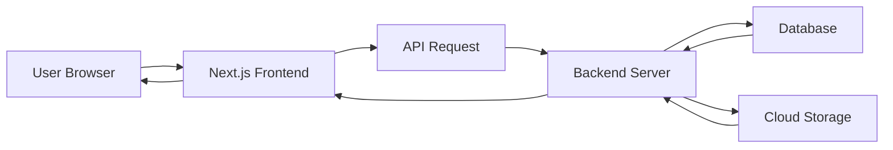

# 🏗️ Architecture – LokalAds

## 📌 Overview

This document describes the system architecture for the LokalAds classified platform.

---

## 🧩 High-Level Architecture

The system follows a **3-tier architecture**:

1. Frontend (Client)
2. Backend (API)
3. Database & Storage

---

## 🖥️ Frontend (Next.js)

### Responsibilities:

* UI rendering
* Routing
* API calls
* State management

### Tech:

* Next.js
* Tailwind CSS

---

## ⚙️ Backend (Strapi / Node.js)

### Responsibilities:

* API handling
* Authentication (JWT)
* Business logic
* Ad management
* User management

---

## 🗄️ Database

### Options:

* MongoDB (NoSQL)
* PostgreSQL (SQL)

### Stores:

* Users
* Ads
* Categories

---

## 🖼️ Media Storage

### Options:

* Cloudinary
* AWS S3

### Stores:

* Ad images
* User uploads

---

## 🔐 Authentication Flow

1. User logs in
2. Backend validates credentials
3. JWT token generated
4. Token sent to frontend
5. Used for authenticated API requests

---

## 🔄 Data Flow

---

## 🧱 Component Architecture (Frontend)

* Navbar
* Homepage
* Category Page
* Product Details Page
* Post Ad Form
* User Dashboard
* Admin Panel

---

## 📡 API Structure (Example)

### Auth APIs

* POST /auth/register
* POST /auth/login

### Ad APIs

* GET /ads
* POST /ads
* PUT /ads/:id
* DELETE /ads/:id

### User APIs

* GET /user/profile
* PUT /user/profile

---

## ⚠️ Scalability Considerations

* Use CDN for images
* Optimize API responses
* Implement caching
* Use pagination for listings

---

## 🔒 Security Considerations

* JWT authentication
* Input validation
* Rate limiting
* Prevent spam ads

---

## 🚀 Future Architecture Improvements

* Microservices architecture
* Real-time chat (WebSockets)
* Notification service
* Payment gateway integration

---
