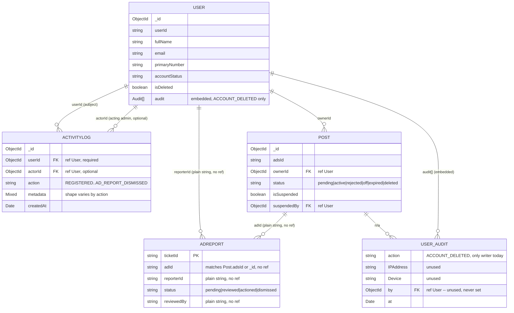
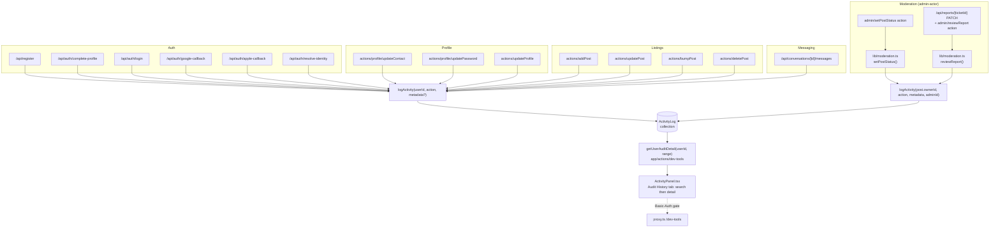
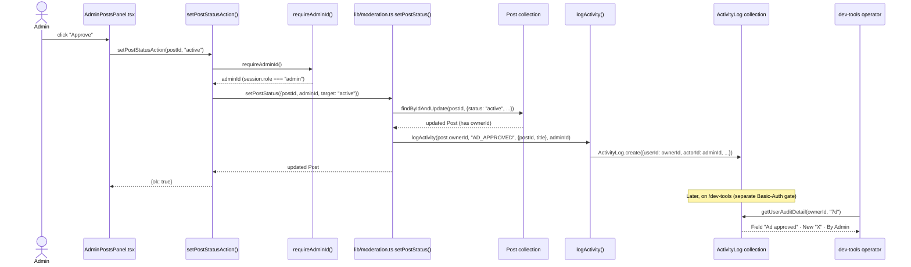

# Audit Flow

Status: describes the codebase as it exists on `main` (see `models/ActivityLog.ts`,
`lib/activityLog.ts`, `lib/moderation.ts`, `app/dev-tools/*`, `app/admin/*`).

## Summary

There are **two independent audit trails** in this codebase, and they are not
the same system:

1. **`ActivityLog`** — a dedicated, indexed Mongo collection. One document per
   event (login, profile edit, ad posted, ad moderated, message sent, …).
   This is the real, actively-growing audit trail and the subject of this doc.
2. **`User.audit[]`** — a small embedded array on the `User` document itself,
   legacy/limited to account-level milestones. Today it has exactly one
   writer: `ACCOUNT_DELETED`, pushed by `softDeleteAccount`
   (`app/actions/profile/deleteAccount.ts`). See
   [`docs/account-deletion-flow.md`](./account-deletion-flow.md).

`ActivityLog` was deliberately split out as its own collection rather than
extending `User.audit[]` — a comment in `models/ActivityLog.ts` explains why:
some actions (`MESSAGE_SENT` in particular) are high-frequency, and an array
embedded in `User` would risk hitting MongoDB's 16MB document cap for an
active user. A dedicated collection scales to any volume and supports
counting/filtering per user via an index, rather than an in-memory array scan.

## 1. `ActivityLog` — schema

`src/models/ActivityLog.ts`, collection `activitylogs`.

| Field | Type | Notes |
|---|---|---|
| `userId` | `ObjectId`, ref `User`, required | Whose feed this event shows up in (the *subject*) |
| `action` | `string` (`ActivityAction` union), required | See action table below — no schema-level enum, just a TS union |
| `metadata` | `Mixed`, optional | Free-form payload — shape varies per action (see table) |
| `actorId` | `ObjectId`, ref `User`, optional | Who *performed* the action, only set when different from `userId` (e.g. an admin moderating someone else's ad). Unset for ordinary self-service events |
| `createdAt` | `Date` | `timestamps: { createdAt: true, updatedAt: false }` |

Indexes (both compound, both `userId`-first — every current read path scopes
to one user or reads everything unscoped, never `action` alone):

- `{ userId: 1, createdAt: -1 }` — primary pattern: "this user's activity,
  newest first"
- `{ userId: 1, action: 1, createdAt: -1 }` — filtering one user's feed by
  action type

Both current indexes are `userId`-first, matching `getUserAuditDetail()`'s
single read pattern (one user's activity, optionally range-filtered).

### Write path

`logActivity(userId, action, metadata?, actorId?)` in `src/lib/activityLog.ts`
is the single write entrypoint. It is **fire-and-forget**: wrapped in
`try/catch`, swallows its own errors (`console.error` only) so a logging
failure can never break the feature it's attached to.

```ts
export async function logActivity(
  userId: string | Types.ObjectId,
  action: ActivityAction,
  metadata?: Record<string, unknown>,
  actorId?: string | Types.ObjectId
): Promise<void>
```

### Actions — trigger, caller, metadata

| Action | Triggered by | File | `metadata` | `actorId` set? |
|---|---|---|---|---|
| `REGISTERED` | Credentials signup completes | `app/api/register/route.ts` | `{ method: "credentials" }` | no |
| `REGISTERED` | OAuth/passwordless profile completion | `app/api/auth/complete-profile/route.ts` | `{ method }` | no |
| `LOGIN` | Credentials login | `app/api/auth/login/route.ts` | — | no |
| `LOGIN` | Google OAuth callback | `app/api/auth/google-callback/route.ts` | — | no |
| `LOGIN` | Apple OAuth callback | `app/api/auth/apple-callback/route.ts` | — | no |
| `LOGIN` | Magic-link / OTP resolve | `app/api/auth/resolve-identity/route.ts` | — | no |
| `EMAIL_CHANGED` | Contact update (email branch) | `app/actions/profile/updateContact.ts` | `{ from, to }` | no |
| `PHONE_CHANGED` | Contact update (phone branch) | `app/actions/profile/updateContact.ts` | `{ from, to }` | no |
| `PASSWORD_CHANGED` | Password update | `app/actions/profile/updatePassword.ts` | — | no |
| `NAME_CHANGED` / `USERID_CHANGED` / `ROLE_CHANGED` / `DOB_CHANGED` / `GENDER_CHANGED` | Profile form save, one entry per changed field | `app/actions/updateProfile.ts` (`FIELD_ACTIONS` map) | `{ from, to }` | no |
| `POST_CREATED` | New ad submitted | `app/actions/addPost.ts` | `{ postId, title }` | no |
| `POST_UPDATED` | Ad edited | `app/actions/updatePost.ts` | `{ postId, title }` | no |
| `POST_BUMPED` | Ad bumped/renewed | `app/actions/bumpPost.ts` | `{ postId, title }` | no |
| `POST_DELETED` | Ad deleted by owner | `app/actions/deletePost.ts` | `{ postId, title }` | no |
| `MESSAGE_SENT` | Chat message sent | `app/api/conversations/[id]/messages/route.ts` | `{ conversationId }` | no |
| `AD_APPROVED` / `AD_REJECTED` / `AD_SET_PENDING` / `AD_SUSPENDED` | Admin sets a post's status | `lib/moderation.ts` → `setPostStatus()` (called by `app/actions/admin/setPostStatus.ts` → `/admin` Posts tab) | `{ postId, title, reason? }` | **yes** — admin's id |
| `AD_SUSPENDED` | Report actioned | `lib/moderation.ts` → `reviewReport()` | `{ postId, title, ticketId, reason }` | **yes** |
| `AD_REPORT_REVIEWED` | Report marked reviewed (no action) | `lib/moderation.ts` → `reviewReport()` | `{ postId, title, ticketId, reason }` | **yes** |
| `AD_REPORT_DISMISSED` | Report dismissed | `lib/moderation.ts` → `reviewReport()` | `{ postId, title, ticketId, reason }` | **yes** |

`AD_*` moderation events are logged against `post.ownerId` (the *ad owner's*
feed), not the admin's — the admin only shows up as `actorId`. Both
`setPostStatus()` and `reviewReport()` are best-effort here too: if the post
has no `ownerId` (or, for reports, if the reported ad no longer resolves to a
live `Post`), no `ActivityLog` row is written at all — moderation of the
document itself still proceeds.

## 2. Read paths

- **`getUserAuditDetail(userId, range)`**
  (`app/actions/dev-tools/getUserAuditDetail.ts`) — the single read path for
  the Audit History tab. Returns that user's header info (`fullName`,
  `publicRole`/`roleTitle`/`roleDescription`/`customRole`, and the internal
  `uuid` — explicitly opted into via `.select("+uuid …")` since the schema
  marks it `select: false`, see `models/user.ts`) plus their `ActivityLog`
  entries filtered to `range` (`"24h" | "7d" | "30d" | "all"`, capped at
  500, newest first, actor populated).
- **`listUsers(userId)`** (`app/actions/dev-tools/listUsers.ts`) — all users,
  newest first; doubles as the search source for both the Users tab and
  Audit History's search screen.

### UI

`app/dev-tools/DevToolsClient.tsx` renders three tabs — **Users**, **Deleted
users**, **Audit History**:

- **Users**: browse/inspect only (list + registration-status fields). No
  longer has a delete action — see Access control below — but a "View
  activity history →" button cross-links into Audit History for the
  selected user (controlled `LaTabs` + an `initialUserId` prop passed to
  `ActivityPanel`).
- **Audit History** (`ActivityPanel.tsx`): a two-screen, search-first flow
  (redesigned 2026-08-07 off a hand-sketched wireframe) —
  1. **Search** — filter by name/email/phone/user ID, pick a user from the
     list (each row a button with a trailing arrow icon).
  2. **Detail** — masked `uuid`, name, and role in a header card; a
     24h/7d/30d/All range toggle (default 7d); a flat table (Timestamp |
     Field | Old value | New value | By) — one row per `ActivityLog` entry,
     diff-carrying actions show old→new, everything else falls back to a
     short summary (`rowForEntry()`).

`activityLabels.ts` (`ACTIVITY_LABELS`, `FIELD_NAMES`) is still the shared
vocabulary both the table's `Field` column and any future consumer use to
turn an `ActivityAction` into human copy.

## Access control — two independent gates

| Surface | Gate | Mechanism | Can read `ActivityLog`? | Can write `ActivityLog`? | Can hard-delete a `User`? |
|---|---|---|---|---|---|
| `/dev-tools` (Users, Deleted users, Audit History) | `proxy.ts` Basic Auth (`BASIC_AUTH_USER`/`PASS`) | Same gate as `/design-system`, `/snippets` — **not** role-based, fails closed if unset | **Yes** — only reader in the codebase | No | No — moved to `/admin` (2026-08-07), see below |
| `/admin` (Posts, Reports, Users) | Real session + `requireAdminId()` | `session.role === "admin"`, itself derived from a hardcoded allowlist in `lib/admin.ts` (`isAdminEmail`) — deliberately *not* the self-editable `User.publicRole` field | No | **Yes** — every moderation action here writes via `lib/moderation.ts` | **Yes** — `actions/admin/hardDeleteUser.ts` |

These don't overlap: `/admin` actions are what *generate* the `AD_*` rows,
but `/admin` itself has no UI that reads `ActivityLog` back — the only place
any of that history is visible is `/dev-tools`'s Basic-Auth-gated Audit History
tab, which is a dev tool, not a production admin feature.

Permanent account deletion (`hardDeleteUser`) used to live under `/dev-tools`,
gated only by the same shared Basic Auth as the rest of that dev tool. It now
lives under `/admin` → Users, behind the real per-admin session gate — a
destructive, irreversible action warranted stronger, individually-attributable
access control than a shared password. `/dev-tools` → Users keeps read-only
browse/inspect (list + registration-status fields) for quick dev lookups.
Deliberately still a separate action from `softDeleteAccount`
(`app/actions/profile/deleteAccount.ts`) — see Summary above for why the two
must not be merged. See Comments / Issues.

---

## Diagrams

### DB structure



`ActivityLog.metadata.postId` / `.ticketId` are **plain strings inside a
`Mixed` field**, not schema-level refs — the diagram shows the *logical*
relationship (which document an event is about), not an enforced foreign key.
Same caveat applies to `AdReport.adId`/`reporterId`/`reviewedBy`, which are
untyped strings even in the report model itself.

### Write-path call chart



### Sequence — an admin moderation action, end to end



---

## Comments / Issues

1. **No production-facing audit UI.** Every `AD_*` moderation event is
   written by `/admin` (real, session-gated), but the only surface that reads
   `ActivityLog` back is `/dev-tools`'s Audit History tab — a Basic-Auth-gated
   dev tool (same gate as `/design-system`/`/snippets`), not role-gated to
   admins specifically. Anyone holding the shared Basic Auth credentials for
   staging can browse every user's full activity feed; conversely, a real
   `/admin` user has no in-product way to review their own moderation
   history.
2. **No global feed anymore.** The redesign (2026-08-07) dropped the
   cross-user "everyone's activity, newest first" view in favor of a
   search-first, per-user flow — there's currently no single screen to spot
   a burst of suspicious activity across accounts without already knowing
   which user to look at.
3. **`ActivityLog` has no cascade on user deletion.** `admin/hardDeleteUser()`
   does a bare `User.deleteOne` — it does not touch `ActivityLog`, so
   hard-deleting a test user leaves orphaned rows with a `userId`/`actorId`
   that no longer resolves; `getUserAuditDetail()` for that id now returns
   `{ user: null, entries: [] }` ("User not found") with no visible orphan
   warning. The real soft-delete flow (`softDeleteAccount`) doesn't touch
   `ActivityLog` either, but that's arguably correct there since the `User`
   document still exists.
4. **`User.audit[].by` is `ref: "User"` but is never actually set** — the
   one writer (`ACCOUNT_DELETED` in `deleteAccount.ts`) never populates
   `by`, `IPAddress`, or `Device`, so those three fields are dead weight on
   every entry pushed today.
5. **Two different "who did this" conventions.** `ActivityLog.actorId` is
   optional and only set for admin-on-someone-else actions; `User.audit[].by`
   exists for the same purpose but is unused. If `User.audit[]` is ever
   extended to more actions, worth deciding whether it should be retired in
   favor of `ActivityLog` entirely rather than maintaining both conventions.
