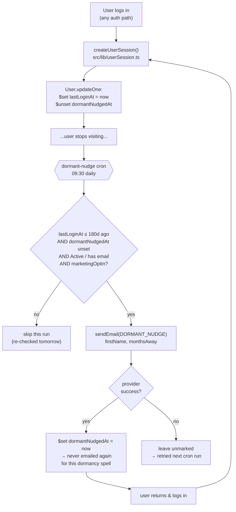
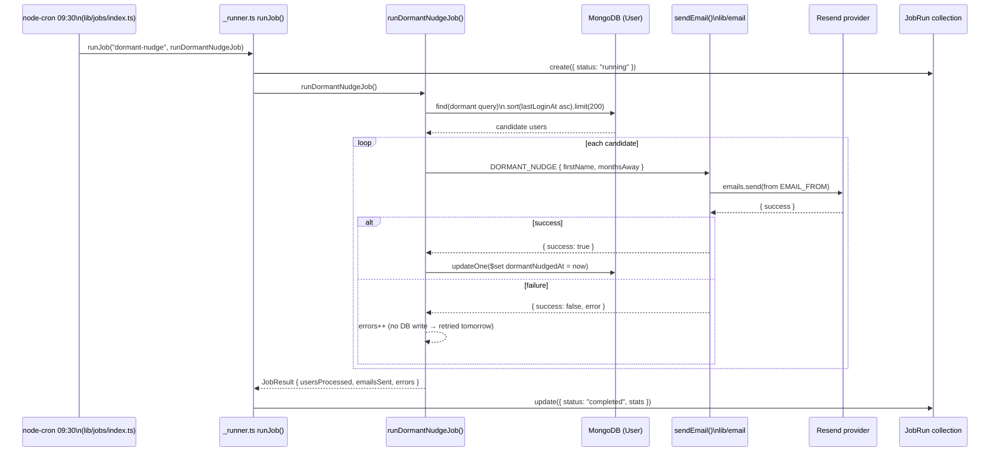
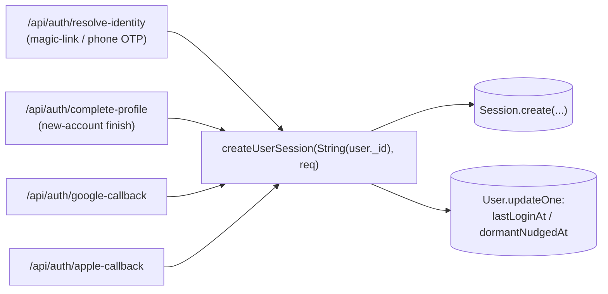

# Dormant-User Nudge Flow

Status: implemented, builds clean (`npm run build`), new files lint clean.
The `DORMANT_NUDGE` template was rendered and sent once through the real
email engine (Resend) to a throwaway test inbox to eyeball the content —
`{ success: true }`. The full job has **not** been run against real data yet —
it needs `scripts/backfill-lastLoginAt.ts` run once first (see "Deploy steps"),
otherwise it matches zero users.

## Summary

A daily cron job (`dormant-nudge`, `30 9 * * *`) audits users who have not
signed in for **180 days (~6 months)** and sends each **exactly one**
re-engagement email ("it's been about 6 months…") with a single CTA button
linking back to the site (`NEXT_PUBLIC_APP_URL`).

"Last signed in" is a new `User.lastLoginAt` timestamp, stamped on every
successful login at the one chokepoint all auth paths share
(`createUserSession()` in `src/lib/userSession.ts`). The same write clears the
per-user `dormantNudgedAt` guard, so a user who comes back and later goes
quiet again for another 180 days becomes eligible for a fresh nudge — but is
never emailed twice for the same dormancy spell.

## Moving parts

| Concern | File | Notes |
|---|---|---|
| Login timestamp | `src/models/user.ts` | `lastLoginAt` (Date, **indexed** — job filters on it), `dormantNudgedAt` (Date) |
| Stamp on login | `src/lib/userSession.ts` → `createUserSession()` | `$set lastLoginAt`, `$unset dormantNudgedAt`. Best-effort — a failure here never blocks sign-in |
| The job | `src/lib/jobs/dormant-nudge.job.ts` | `runDormantNudgeJob()` — selection query + per-user send loop |
| Schedule | `src/lib/jobs/index.ts` | `cron.schedule("30 9 * * *", …)` — 6th registered job |
| Manual trigger | `src/app/api/jobs/trigger/route.ts` | `JOB_MAP["dormant-nudge"]`; `POST` with `x-cron-secret` header |
| Run logging | `src/models/JobRun.ts`, `src/lib/jobs/_types.ts` | `"dormant-nudge"` added to `JobName`; new optional `usersProcessed` stat |
| Email type | `src/lib/email/types.ts` | `DORMANT_NUDGE` — `data: { firstName: string; monthsAway: number }` |
| Subject | `src/lib/email/subjects.ts` | `"It's been a while, {firstName} — your LokalAds account is still here"` |
| Renderer wiring | `src/lib/email/renderer.ts` | `case "DORMANT_NUDGE"` |
| Template | `src/lib/email/templates/engagement/dormant-nudge.tsx` | `DormantNudgeEmail()` HTML + `dormantNudgeText()` plain-text fallback |
| Preview | `src/lib/email/preview-data.ts` | one entry for `/design-system/feature/email-engine` |
| One-time backfill | `scripts/backfill-lastLoginAt.ts` | seeds `lastLoginAt` for pre-existing users from `Session` activity |

## Tunable constants (top of `dormant-nudge.job.ts`)

| Constant | Value | Meaning |
|---|---|---|
| `DORMANT_THRESHOLD_DAYS` | `180` | Days since `lastLoginAt` before a user is a candidate |
| `MARKETING_OPT_IN_ONLY` | `true` | Only send to `marketingOptIn: true` users. Flip to `false` to send to every dormant user. Default `marketingOptIn` is `false`, so as-is the reach is small until opt-ins grow |
| `MAX_PER_RUN` | `200` | Cap per run; the daily cron drains a larger backlog over days, oldest-login-first |

## Selection query

```js
{
  accountStatus: "Active",
  isDeleted:   { $ne: true },
  isSuspended: { $ne: true },
  email:       { $exists: true, $nin: [null, ""] },
  lastLoginAt: { $lte: <now - 180d> },
  dormantNudgedAt: { $exists: false },   // "not yet nudged this spell"
  marketingOptIn: true,                  // only when MARKETING_OPT_IN_ONLY
}
```

`.sort({ lastLoginAt: 1 }).limit(MAX_PER_RUN)` — fairest drain of the backlog.

## Per-user send

1. Derive `firstName` from `fullName.split(/\s+/)[0]` (falls back to `"there"`).
2. `monthsAway = max(6, floor(daysSinceLogin / 30))` — copy reads "about N months".
3. `sendEmail({ type: "DORMANT_NUDGE", to: email, data: { firstName, monthsAway } })`.
4. **On success only**: `$set dormantNudgedAt = now`. A failed send is left
   unmarked, so the next cron cycle retries it rather than silently dropping it.

`JobResult` returned: `{ usersProcessed, emailsSent, errors, … }` — written to
the `JobRun` record by `_runner.ts` and visible in the
`/design-system/feature/batch-run` debug view.

## Diagrams

### Lifecycle — one user



`createUserSession()` clearing `dormantNudgedAt` on the return login (dashed
path back to the top) is what makes the nudge repeatable across separate
dormancy spells while staying once-per-spell.

### One cron run



### Which auth paths feed `lastLoginAt`



All four already call `createUserSession()` with the stringified Mongo
`_id` — no route-level change was needed; the stamp lives entirely inside the
shared helper.

## Deploy steps

1. Ship the code. `User.lastLoginAt` / `dormantNudgedAt` are additive — no
   migration needed for the schema itself.
2. Run once, after deploy, with DB access:
   ```
   npx tsx --env-file=.env.local scripts/backfill-lastLoginAt.ts
   ```
   Seeds `lastLoginAt` for existing users from `max(Session.lastActiveAt,
   Session.createdAt)`, falling back to `User.createdAt` for users with no
   session on record. Without it the job ignores every pre-existing user
   until their next login.
3. Set `CRON_SECRET` in every environment (local `.env.local` + Vercel
   Production) or `/api/jobs/trigger` returns `500 CRON_SECRET not configured`.
   The off-Vercel `node-cron` schedule (`instrumentation.ts` →
   `initJobRunner()`) calls jobs in-process and needs no secret; the HTTP
   trigger — which is how Vercel Cron drives everything in production — does.

## Manual run

```bash
curl "http://localhost:3000/api/jobs/trigger?job=dormant-nudge" \
  -H "Authorization: Bearer $CRON_SECRET"
# legacy header also accepted:  -H "x-cron-secret: $CRON_SECRET"
```

The handler awaits the job and returns `200 {"ran":"dormant-nudge","ok":true,
"result":{…}}` (or `500 {"ok":false,"error":…}`). The same `JobResult` is also
written to the `JobRun` collection (`jobName: "dormant-nudge"`,
`stats.usersProcessed` / `stats.emailsSent` / `stats.errors`).

## The email

- **Subject**: `It's been a while, {firstName} — your LokalAds account is still here`
- **From**: `EMAIL_FROM` (default `LokalAds <no-reply@lokalads.com>`) — not a
  `TEAM_SENDER` event.
- **Body**: `👋 Hi {firstName}, it's been a while` · "about {monthsAway} months
  since you last signed in" · three highlight rows (new listings / saved
  alerts / your stuff is still here) · blue "pick up where you left off" note ·
  **"Visit LokalAds"** button → `APP_URL` · inline text link to the bare domain.
- **Plain-text fallback**: `dormantNudgeText()` in the same file.
- **Preview**: `/design-system/feature/email-engine` → "Dormant Nudge — ~6
  Months Since Last Login" (Basic-Auth gated).

## Known gaps / out of scope

- **No backfill = no historical reach.** Covered by the deploy step above;
  called out here because forgetting it makes the job look broken (runs
  clean, emails nobody).
- **`marketingOptIn` reach.** With the flag on and the field defaulting to
  `false`, real-world matches will be sparse until opt-in rates climb. Product
  decision, one-line to change.
- **No unsubscribe-specific handling.** Relies on `marketingOptIn` as the
  consent gate; there's no per-email opt-out link wired into this template
  beyond the base shell footer.
- **Not consolidated with `win-back`.** The unused `win-back` template
  (30/60-day tiers) still exists separately. If a single tiered inactivity
  system is wanted later, these should merge.

## Scheduling (two paths, one per environment)

| Environment | Scheduler | Mechanism |
|---|---|---|
| Local dev / self-hosted | `node-cron` | `src/instrumentation.ts` → `initJobRunner()` registers all 6 schedules. Guarded by `!process.env.VERCEL` so it **doesn't** run on Vercel |
| Production (Vercel Hobby) | **GitHub Actions** | `.github/workflows/cron-jobs.yml` — one `on.schedule` entry per job, POSTs `/api/jobs/trigger?job=<name>` with `Authorization: Bearer $CRON_SECRET` |

Vercel's own `vercel.json` `crons` was the original plan but the project is on
the **Hobby** plan (max 2 cron jobs, daily-only), which rejects the whole
deployment over `alert-match`'s `*/5 * * * *`. GitHub Actions has no such cap
and free unlimited minutes on public repos. If the project ever moves to
Vercel **Pro**, re-add the `crons[]` block to `vercel.json` and delete the
workflow — the route supports both callers unchanged.

`src/app/api/jobs/trigger/route.ts`: `GET` + `POST`, auth via
`Authorization: Bearer` **or** the legacy `x-cron-secret` header (manual/curl),
job name from `?job=`, a POST body `{ job }`, or the `x-vercel-cron-schedule`
header (`SCHEDULE_TO_JOB`, only relevant if driven by Vercel Cron). The handler
**awaits** the job and returns its `JobResult` — a fire-and-forget 202 is
unsafe on Vercel, where the function freezes the moment the response is sent.

### Setup

- **`CRON_SECRET`** in three places, all the same value: local `.env.local`,
  Vercel env (so the route works), and the **GitHub Actions repo secret**
  (Settings → Secrets and variables → Actions).
- Optional repo **variable** `APP_URL` (defaults to `https://www.lokalads.com`).
- The workflow's `schedule:` triggers only run from the file **on the repo's
  default branch**. The default branch is currently `develop`; this file lives
  on `main`. Either change the default branch to `main` (matches the
  production deploy flow) or merge the workflow to `develop`.
  `workflow_dispatch` (manual "Run workflow" button, with a job picker) works
  from any branch that has the file.

### Known gaps

- **GitHub Actions schedule drift.** Scheduled runs can be delayed several
  minutes under GitHub load, and the whole schedule auto-disables after 60
  days with zero repo commits. Fine for this repo's activity level.
- **`alert-match` frequency.** `*/5` = 288 runs/day. Free on public repos;
  on a private repo it would burn the Actions minutes quota.
