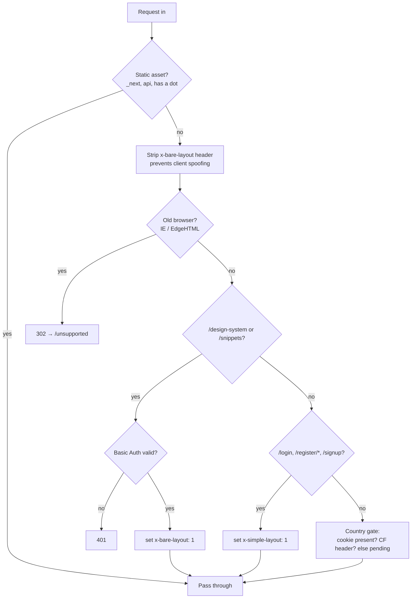

# LokalAds — Architecture Big Picture

> **The one-page story of how this system is put together.** Read this first, before diving into the detailed folders below.
> Last updated: **2026-07-13**
>
> Ownership: **Copilot updates this file** whenever an architecture-level decision is made or changed (new seam, new layer rule, middleware step added/removed, a stub gets replaced with something real). Owner reviews for accuracy but doesn't need to write it by hand.
> Detailed docs: `auth/` · `database/` · `api/` · `journeys/` · `state/` · `components/` (see [README.md](README.md))
> Quick brief: `.github/copilot-instructions.md` · Project bible: `../context.md`
> **Full real-API gap analysis** (every backend endpoint the whole app still needs, grouped by domain, with status + "used by" screens): [api/07-real-api-gap-inventory.md](api/07-real-api-gap-inventory.md)

---

## The Story, in Six Chapters

### 1. A request walks in the door — Middleware is the one gatekeeper

Every request hits [src/proxy.ts](../../src/proxy.ts) first, in this exact order:



No page ever has to think about auth, UA sniffing, or layout mode — it's already been decided before the route handler runs. **One chokepoint, not scattered checks in every route.**

### 2. The shell never gets rebuilt — Layout Signal System

There is exactly **one** `AppHeader` and **one** `AppFooter`, owned by the root [layout.tsx](../../src/app/layout.tsx). No nested `layout.tsx` is ever allowed to add its own header/footer. Instead, middleware sets a request header (`x-bare-layout`, `x-simple-layout`, or nothing), and the root layout reads it once at render time to pick a `variant`. This guarantees the app shell can never fork or drift as new routes are added — see the hard rule in [copilot-instructions.md](../../.github/copilot-instructions.md#layout-signal-system--hard-rule).

### 3. Three layers of components — a factory line, not a free-for-all

```
Pages / feature components
        │  (only ever import from here)
        ▼
components/la/          ← Layer 1: raw primitives (LaButton, LaInput, LaChip...)
        ▲
        │  built on top of
components/la-blocks/   ← Layer 2: assembled product sections (AppHeader, CategoryGrid...)
        ▲
        │  wraps
components/ui/          ← Layer 3: shadcn/Radix primitives — never imported directly by pages
```

"STOP rules" force a deliberate decision point before anyone reaches past this stack — see [copilot-instructions.md](../../.github/copilot-instructions.md#stop-rules--ask-before-acting). This is what keeps the UI consistent as the number of contributors grows.

### 4. Mock today, real tomorrow — same shape either way

Every mock file (`lib/mock/{in,gb,sg}/<category>/sellers.ts`, listing arrays, etc.) is typed against the same canonical contract — [types/listing.ts](../../src/types/listing.ts)'s `Listing` and `Seller` interfaces. A page component never knows or cares whether the data came from a JSON mock or a Mongoose query. This is why extending the seller-profile linkage (2026-07-13) only needed one *optional* field (`handle?: string`) added to a shared type — not a rewrite of all 44 mock seller pools. **The mock→real swap is meant to be a data-source substitution, not a rewrite.**

### 5. Three countries, one codebase

IN/GB/SG are not three separate apps. The middleware country gate + `CountryProvider` + `CountryDetector` (ipinfo.io) + `OverlayCountrySelect` resolve which market a visitor is in, and the *same* route tree renders differently per market. The only per-country duplication today is the mock-data folder structure (`lib/mock/in/`, `/gb/`, `/sg/`) — the intentional seam where a real API would key by country param instead of folder path.

### 6. The API boundary is a hard wall

No page or component is allowed to `fetch()` an external URL directly. Everything goes through `app/api/*` route handlers first (see [la-api-route.instructions.md](../../.github/instructions/la-api-route.instructions.md)). This is where auth headers, rate limiting, and input sanitization will live centrally — when real backends arrive, only the API layer changes, not every page that needs data.

---

## Current State — What's a Real Seam vs. What's Still a Stub

| Seam | Status | Notes |
|---|---|---|
| Middleware / routing | ✅ Real | 7-step order, deterministic, documented |
| Layout signal system | ✅ Real | Enforced by hard rule, no known violations |
| 3-layer component system | ✅ Real | STOP rules in place |
| Canonical types (`Listing`/`Seller`) | ✅ Real | Single source of truth, mock conforms to it |
| Country resolution | ✅ Real | Cookie + CF header + client detection all wired |
| API boundary convention | ✅ Real | Convention enforced by instructions, not yet by lint |
| Auth / session | 🧪 Stub | `lib/session.ts` + 4-level guards exist structurally; no real identity provider wired yet |
| Database reads | 🧪 Stub | Mongoose (`lib/db.ts`) configured; most pages still read mock arrays, not DB queries |
| Seller ↔ public profile linkage | 🧪 Partial | Wired for GB-property's 6 sellers only (2026-07-13); other 43 mock seller pools have no `handle` yet |
| Footer "Popular Category" / "Top Locations" | ✅ Real (mock data) | Fixed 2026-07-13 — now derived per-country from real `enabledCategories` + a new `lib/mock/footer-locations.ts`, instead of a hardcoded India-only list with 2 broken category ids |
| `lib/mock/gb/shared-sellers.ts` | ⚠️ Orphaned | Documented "master pool" pattern, not actually imported anywhere — needs a decision (wire in or delete) |

---

## How to Use the Rest of the Architecture Docs

- **New to the project?** Read this file, then [README.md](README.md)'s folders in order 1→6.
- **Building the data layer?** → `database/`
- **Building API routes?** → `auth/` + `database/` + `api/`
- **Building UI?** → `components/` + `state/`
- **Designing a new feature?** → `journeys/` for the user flow, then the relevant technical folder

## Maintenance Rule
corrected the same day
Whenever an architecture-level decision changes any of the six chapters above (a new middleware step, a new component layer rule, a stub becoming real, a new seam being introduced), **update this file's relevant chapter/table row in the same session** — don't let it drift the way `context.md`'s middleware section did (6-step vs. the actual 7-step order — flagged 2026-07-13, not yet corrected).
