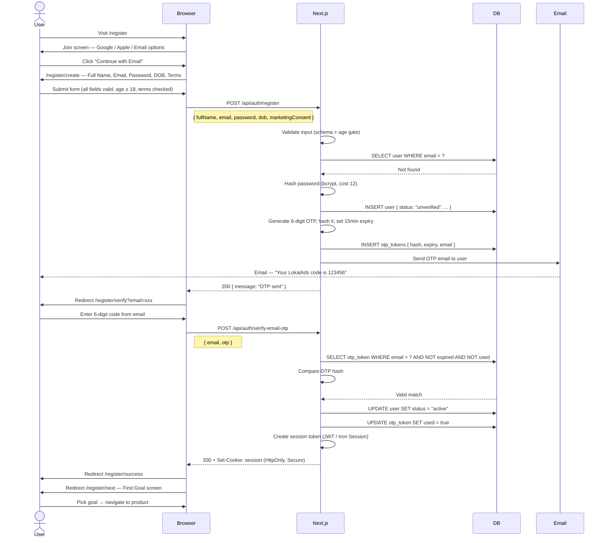
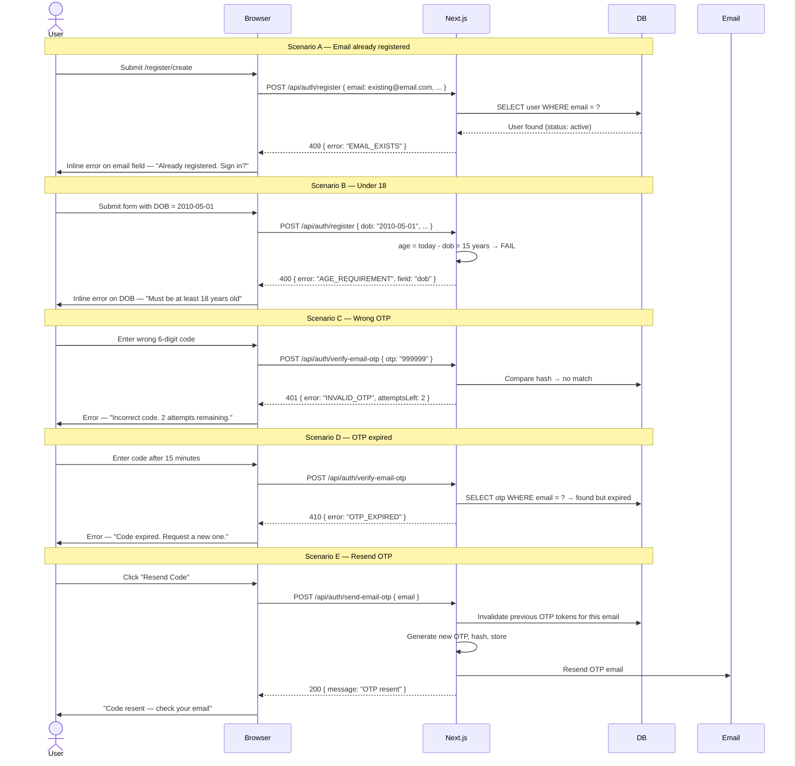

# Flow 1 — Registration via Email + OTP

> User creates a new LokalAds account using email and password.  
> Email is verified via a 6-digit OTP before the account is activated.

**Routes involved:** `/register` → `/register/create` → `/register/verify` → `/register/success` → `/register/next`

---

## Happy Path



---

## Unhappy Paths



---

## API Reference

### `POST /api/auth/register`

**Request:**
```ts
{
  fullName:          string   // 2–100 chars, required
  email:             string   // valid email format, required
  password:          string   // min 8 chars, uppercase, number, special char
  dob:               string   // ISO date "YYYY-MM-DD", must be ≥ 18 years ago
  marketingConsent:  boolean  // optional, default false
}
```

**Responses:**
```ts
201  { message: "OTP sent" }
400  { error: "VALIDATION_ERROR", fields: { ... } }
400  { error: "AGE_REQUIREMENT", field: "dob" }
409  { error: "EMAIL_EXISTS" }
429  { error: "RATE_LIMITED", retryAfter: 900 }
500  { error: "SERVER_ERROR" }
```

---

### `POST /api/auth/send-email-otp`

**Request:**
```ts
{ email: string }
```

**Responses:**
```ts
200  { message: "OTP sent" }
404  { error: "USER_NOT_FOUND" }
429  { error: "RATE_LIMITED", retryAfter: 60 }
```

---

### `POST /api/auth/verify-email-otp`

**Request:**
```ts
{
  email: string
  otp:   string   // 6 digits
}
```

**Responses:**
```ts
200  { message: "Verified" }   + Set-Cookie: session
401  { error: "INVALID_OTP", attemptsLeft: number }
410  { error: "OTP_EXPIRED" }
429  { error: "RATE_LIMITED" }
```

---

## Security Requirements

| Requirement | Detail |
|---|---|
| Password hashing | bcrypt, cost factor 12 — never store plain text |
| OTP storage | Store SHA-256 hash only — raw OTP sent to email, never stored |
| OTP expiry | 15 minutes from generation |
| OTP attempts | Max 3 wrong attempts → invalidate token, force resend |
| Rate limiting | `/register` — 5 req / 15 min per IP · `/send-email-otp` — 3 req / 60s per email |
| Age gate | Validated **server-side** — client check is UX only, not security |
| Session cookie | HttpOnly, Secure, SameSite=Lax, 30 day expiry |

---

## UI Components

| Route | Component | File |
|---|---|---|
| `/register` | `JoinStep` | `app/(auth)/register/JoinStep.tsx` |
| `/register/create` | `CreateAccountStep` | `app/(auth)/register/create/CreateAccountStep.tsx` |
| `/register/verify` | `VerifyEmailStep` | `app/(auth)/register/verify/VerifyEmailStep.tsx` |
| `/register/success` | `AccountCreatedStep` | `app/(auth)/register/success/AccountCreatedStep.tsx` |
| `/register/next` | `FirstGoalStep` | `app/(auth)/register/next/FirstGoalStep.tsx` |
