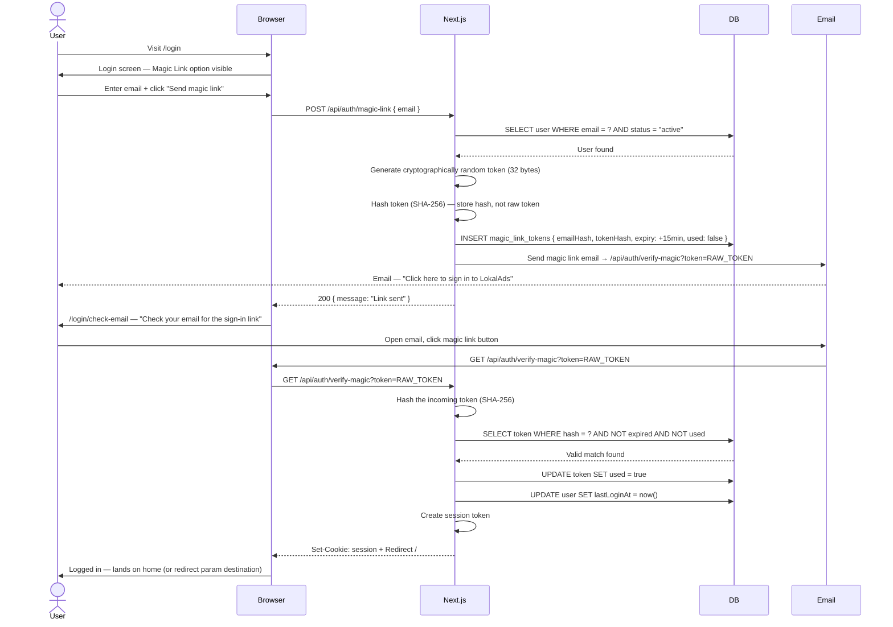
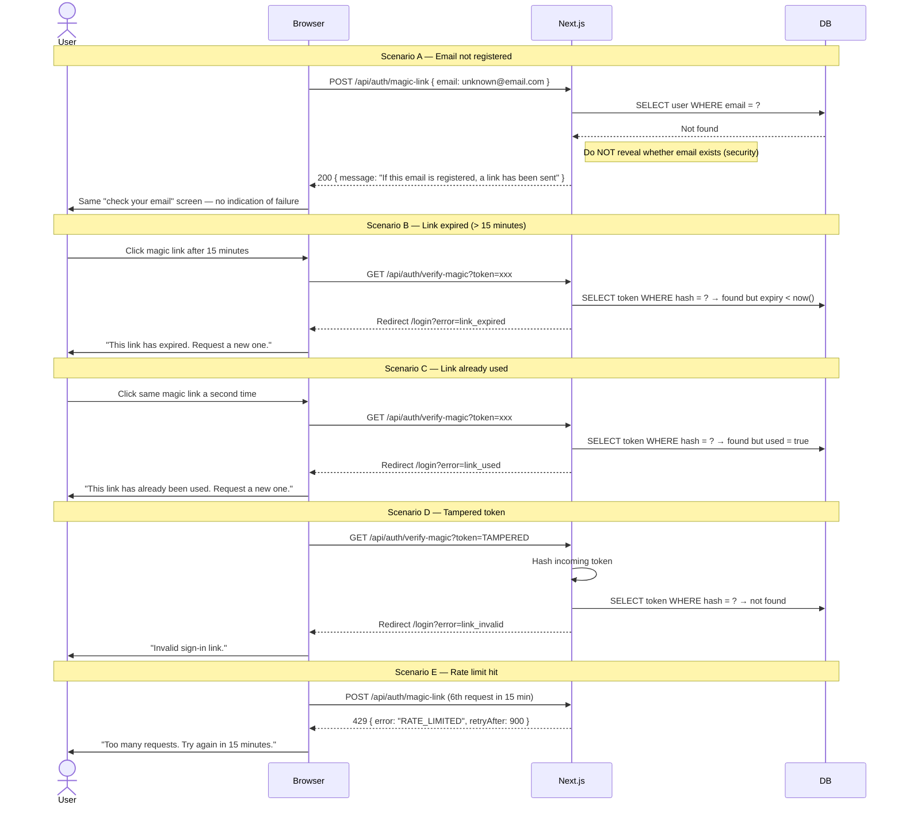

# Flow 4 — Login via Magic Link

> Passwordless login — user enters their email and receives a one-click sign-in link.  
> No password required. Link expires after 15 minutes and can only be used once.

**Routes involved:** `/login` → `/login/check-email` → `/api/auth/verify-magic` → `/`

---

## Happy Path



---

## Unhappy Paths



---

## API Reference

### `POST /api/auth/magic-link`

**Request:**
```ts
{ email: string }
```

**Responses:**
```ts
200  { message: "If this email is registered, a link has been sent" }
// Always 200 — never reveal if email exists or not
429  { error: "RATE_LIMITED", retryAfter: 900 }
500  { error: "SERVER_ERROR" }
```

---

### `GET /api/auth/verify-magic`

**Query params:** `token` — raw token from email link

**Logic:**
1. Hash incoming token with SHA-256
2. Look up hash in DB
3. Check: not expired, not already used
4. Mark token as used
5. Create session + redirect

**Responses:**
```
302  Redirect /               (success — session cookie set)
302  Redirect /login?error=link_expired
302  Redirect /login?error=link_used
302  Redirect /login?error=link_invalid
```

---

## Security Requirements

| Requirement | Detail |
|---|---|
| Token generation | `crypto.randomBytes(32)` — cryptographically random, not predictable |
| Token storage | Store SHA-256 hash only — raw token sent in email, never in DB |
| Token expiry | 15 minutes from generation |
| Single use | Mark `used = true` immediately on first valid use |
| Email enumeration | Always return 200 even if email not found — never reveal registration status |
| Rate limiting | Max 3 magic link requests / 15 min per email address |
| Redirect validation | After login, only allow internal paths — never redirect to external URLs |

---

## Token Generation (reference implementation)

```ts
import crypto from "crypto";

// Generate raw token
const rawToken = crypto.randomBytes(32).toString("hex"); // 64 char hex string

// Hash for storage
const tokenHash = crypto.createHash("sha256").update(rawToken).digest("hex");

// Store hash in DB
await db.magicLinkTokens.create({
  tokenHash,
  email,
  expiresAt: new Date(Date.now() + 15 * 60 * 1000), // 15 min
  used: false,
});

// Send raw token in email URL
const magicLink = `${process.env.NEXT_PUBLIC_URL}/api/auth/verify-magic?token=${rawToken}`;
```

---


