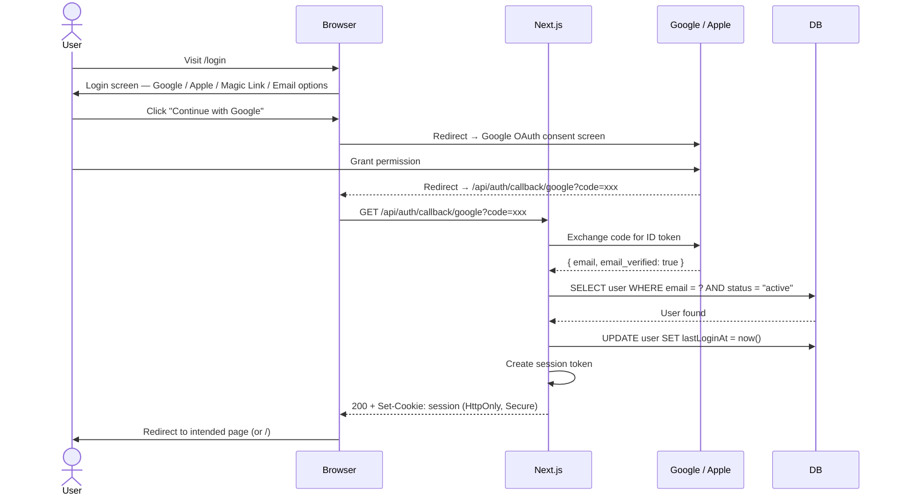
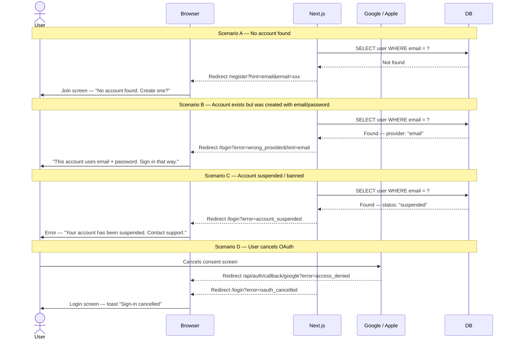

# Flow 3 — Login via Google / Apple OAuth

> Returning user signs in to their existing LokalAds account using Google or Apple.  
> No password needed — identity is verified by the OAuth provider.

**Routes involved:** `/login` → OAuth provider → `/api/auth/callback/*` → `/`

---

## Happy Path



---

## Unhappy Paths



---

## API Reference

### `GET /api/auth/callback/google`
### `GET /api/auth/callback/apple`

**Logic:**
1. Verify `state` param (CSRF check)
2. Exchange `code` for ID token
3. Verify token signature with provider public key
4. Extract `email`, verify `email_verified: true`
5. Look up user in DB
6. Branch: existing → login · new → register · suspended → error
7. Set session cookie + redirect

---

## Security Requirements

| Requirement | Detail |
|---|---|
| CSRF protection | Generate `state` param before redirect, verify on callback |
| Token verification | Verify ID token signature using provider's JWKS endpoint |
| Email verified | Reject tokens where `email_verified: false` |
| Provider mismatch | If account exists with different provider → reject with clear error |
| Rate limiting | Max 10 OAuth callback attempts / 15 min per IP |

---

## Redirect After Login

Pass intended destination as a `redirect` query param on the login URL:

```
/login?redirect=/post
/login?redirect=/favourites
```

After successful login, read `redirect` param and navigate there (validate it's an internal path — never redirect to external URLs).

---


