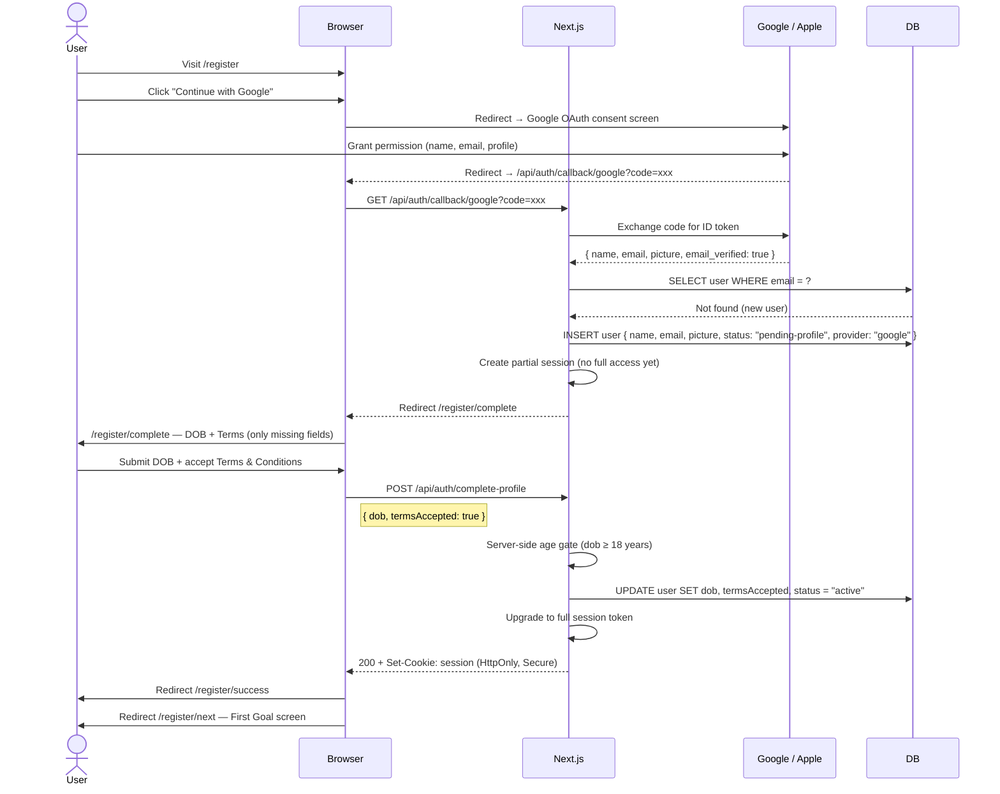
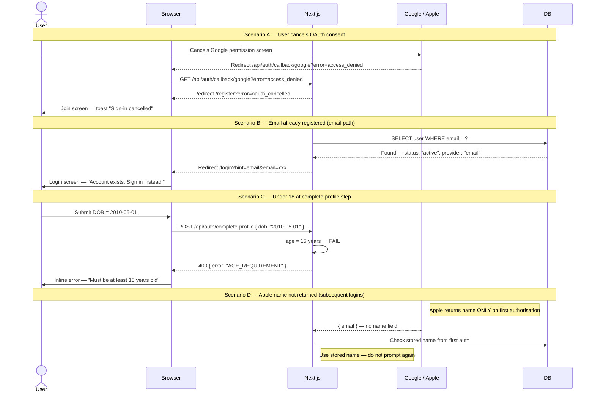

# Flow 2 — Registration via Google / Apple OAuth

> New user creates a LokalAds account by signing in with Google or Apple.  
> OAuth provides name + email — DOB and terms must be collected separately.

**Routes involved:** `/register` → OAuth provider → `/register/complete` → `/register/success` → `/register/next`

---

## Happy Path



---

## Unhappy Paths



---

## Apple-Specific Notes

> ⚠️ **Critical:** Apple returns the user's `name` **only on the very first authorisation**.  
> On every subsequent login, the name field is absent from the token.

**You must store the name immediately** on first callback — before responding to the browser.

```ts
// In /api/auth/callback/apple
const { email, name } = appleToken; // name only present on first auth

await db.upsertUser({
  email,
  name: name ?? existingUser?.name, // fall back to stored name
  provider: "apple",
});
```

---

## API Reference

### `GET /api/auth/callback/google`
### `GET /api/auth/callback/apple`

**Query params:** `code` (auth code from provider) or `error` (if user cancelled)

**Logic:**
1. Exchange `code` for ID token with provider
2. Verify token signature
3. Extract `{ name, email, email_verified, picture }`
4. Upsert user in DB
5. Redirect to `/register/complete` (new) or `/` (existing)

---

### `POST /api/auth/complete-profile`

**Request:**
```ts
{
  dob:               string   // ISO date "YYYY-MM-DD", must be ≥ 18 years ago
  termsAccepted:     boolean  // must be true
  marketingConsent?: boolean  // optional
}
```

**Responses:**
```ts
200  { message: "Profile complete" }   + Set-Cookie: session (upgrade to full)
400  { error: "AGE_REQUIREMENT", field: "dob" }
400  { error: "TERMS_REQUIRED" }
401  { error: "NO_PARTIAL_SESSION" }   // tampered or expired partial session
```

---

## Security Requirements

| Requirement | Detail |
|---|---|
| OAuth state param | Generate + verify `state` param on every OAuth flow — prevents CSRF |
| Token verification | Always verify ID token signature with provider's public key |
| Email verified check | Only accept `email_verified: true` from Google |
| Partial session | Partial session grants access to `/register/complete` only — not product routes |
| Age gate | Server-side validation in `complete-profile` — client check is UX only |
| Apple name storage | Store name immediately on first callback — never retrievable again from Apple |

---


