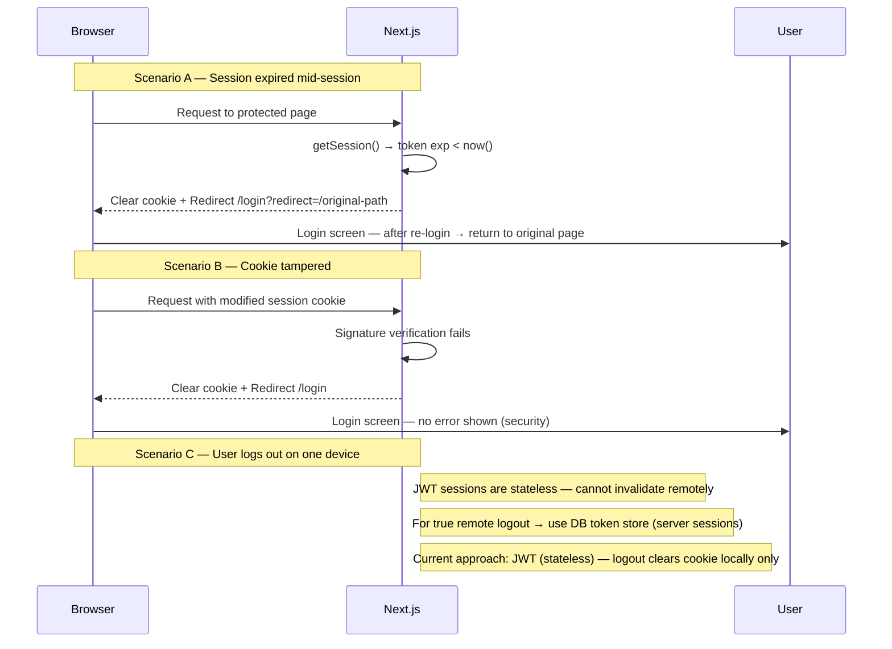

# Flow 5 — Session Management

> How LokalAds creates, maintains, and terminates user sessions.  
> Sessions are stored in an HttpOnly cookie — not in localStorage.

**File:** `lib/session.ts`

---

## Session Lifecycle

```mermaid
sequenceDiagram
    participant Browser
    participant Next.js
    participant DB

    Note over Browser,DB: ── 1. Session Creation (after any successful login) ──

    Next.js->>Next.js: Generate session payload { userId, email, role, iat, exp }
    Next.js->>Next.js: Sign payload → session token (JWT or Iron Session)
    Next.js-->>Browser: Set-Cookie: session=TOKEN; HttpOnly; Secure; SameSite=Lax; Max-Age=2592000
    Note right of Browser: Cookie is HttpOnly — JS cannot read it

    Note over Browser,DB: ── 2. Authenticated Request ──

    Browser->>Next.js: Any request (cookie sent automatically)
    Next.js->>Next.js: Read + verify session cookie (lib/session.ts → getSession())
    alt Valid + not expired
        Next.js-->>Browser: Serve page with user context
    else Expired
        Next.js->>Next.js: Clear cookie
        Next.js-->>Browser: Redirect /login?redirect=CURRENT_PATH
    else Invalid / tampered
        Next.js->>Next.js: Clear cookie
        Next.js-->>Browser: Redirect /login
    end

    Note over Browser,DB: ── 3. Session Refresh ──

    Next.js->>Next.js: If session expires within 24h → renew silently
    Next.js-->>Browser: Set-Cookie: session=NEW_TOKEN (same settings)

    Note over Browser,DB: ── 4. Logout ──

    Browser->>Next.js: POST /api/auth/logout
    Next.js-->>Browser: Set-Cookie: session=; Max-Age=0 (clear cookie)
    Browser->>User: Redirect /
```

---

## Session Payload

```ts
type SessionPayload = {
  userId:    string    // MongoDB ObjectId as string
  email:     string
  name:      string
  role:      "user" | "admin"
  provider:  "email" | "google" | "apple"
  iat:       number    // issued at (Unix timestamp)
  exp:       number    // expiry (Unix timestamp)
}
```

---

## `lib/session.ts` — API

```ts
// Get session from request (Server Component or API route)
export async function getSession(): Promise<SessionPayload | null>

// Create + set session cookie (call after login)
export async function createSession(payload: SessionPayload): Promise<void>

// Clear session cookie (call on logout)
export async function clearSession(): Promise<void>
```

---

## Cookie Settings

```ts
{
  name:     "session",
  httpOnly: true,       // JS cannot access — XSS protection
  secure:   true,       // HTTPS only in production
  sameSite: "lax",      // CSRF protection — allows top-level navigation
  maxAge:   2592000,    // 30 days in seconds
  path:     "/",
}
```

---

## Where `getSession()` is called

| Location | Purpose |
|---|---|
| `app/layout.tsx` | Pass `user` prop to `AppHeader` for avatar + login state |
| `app/api/*` route handlers | Verify user is authenticated before DB operations |
| Protected page Server Components | Redirect to `/login` if no session |

---

## Unhappy Paths



---

## JWT vs Server Session — Decision

| | JWT (current approach) | Server Session (DB-backed) |
|---|---|---|
| Complexity | Simple — no DB lookup per request | Requires DB/Redis lookup per request |
| Remote logout | ❌ Cannot invalidate without blocklist | ✅ Delete record = instant logout |
| Scalability | ✅ Stateless | Requires shared session store |
| Token theft | If stolen, valid until expiry | Can be immediately invalidated |
| **LokalAds choice** | **Start with JWT** | **Add DB blocklist when needed** |

---

## Security Requirements

| Requirement | Detail |
|---|---|
| Cookie flags | HttpOnly + Secure + SameSite=Lax — all three required |
| Signing | Use strong secret — `SESSION_SECRET` env var (min 32 chars) |
| Expiry | 30 days max age · refresh when < 24h remaining |
| HTTPS only | `secure: true` — never transmit session over HTTP in production |
| No localStorage | Never store session token in localStorage or sessionStorage |

---

## Environment Variables

```bash
SESSION_SECRET=    # min 32 char random string — used to sign JWT
                   # generate: openssl rand -base64 32
```

