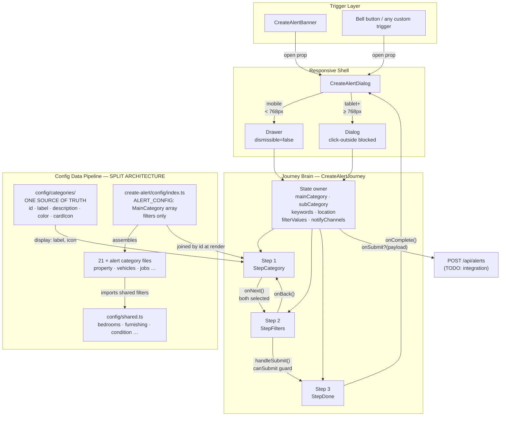
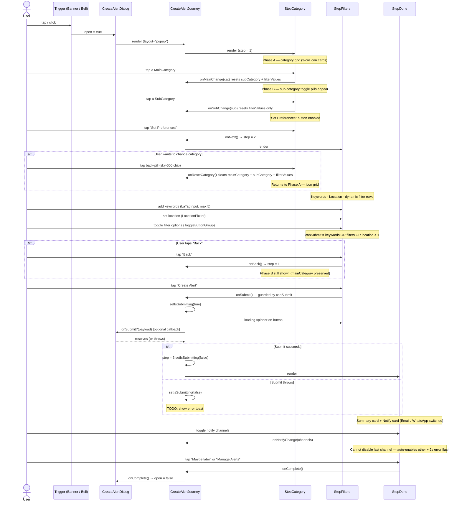
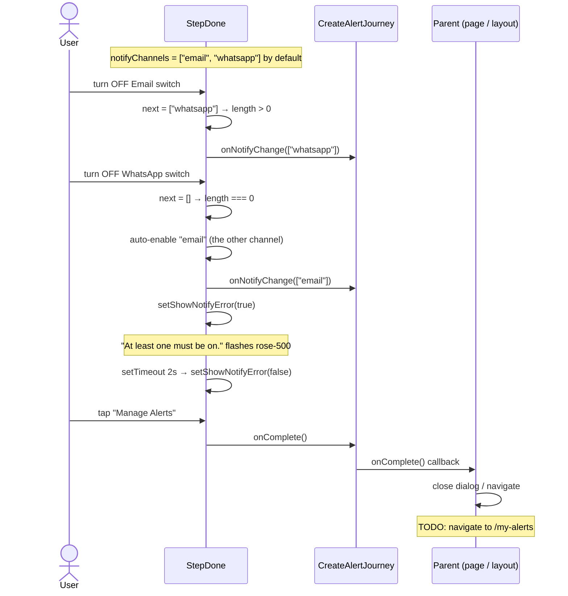

# Create Alert — Component Documentation

**Status:** POC complete — ready for API integration  
**Location:** `components/create-alert/`  
**Snippet preview:** `/snippets/create-alert`  
**Alert filter config:** `components/create-alert/config/` (filters only — do NOT put display data here)  
**Display config:** `config/categories/` (ONE SOURCE OF TRUTH for all category navigation)  
**Types:** `components/create-alert/types.ts`

---

## What it does

Create Alert lets any user (logged in or guest) define a saved search. When new listings match the criteria, the user is notified via Email and/or WhatsApp. The journey is a 3-step guided flow — category selection → preferences → confirmation — rendered as a bottom-sheet drawer on mobile and a centered dialog on tablet+.

Key design decisions:
- **No store.** All state lives locally inside `CreateAlertJourney`. The parent only receives the final `AlertPayload` via `onSubmit?()`.
- **Config split.** Category *display* data (id, label, description, color, icon) lives in `config/categories/` — the project-wide source of truth. Alert *filter* data (subcategory filters, options, types) lives in `components/create-alert/config/`. The journey joins them by `id` at render time.
- **Dismiss-blocked mid-flow.** The Drawer uses `dismissible={false}` and the Dialog blocks click-outside + ESC during Steps 1–2 so users don't lose their selection.

---

## Architecture overview

```
components/create-alert/
├── types.ts                  Pure type definitions — no component imports
├── alert-config.ts           Backward-compat re-export → ./config
├── config/
│   ├── index.ts              Barrel — assembles ALERT_CONFIG[]
│   ├── shared.ts             Reusable FilterConfig constants (bedrooms, fuel type, etc.)
│   └── [category].ts         One file per category (21 categories)
├── CreateAlertJourney.tsx    3-step flow — the core UI
├── CreateAlertDialog.tsx     Responsive shell: Drawer (mobile) / Dialog (tablet+)
├── CreateAlertBanner.tsx     Banner trigger — primary entry point
└── index.ts                  Public barrel export
```

---

## Component tree

```
CreateAlertBanner          → decorative CTA banner; opens CreateAlertDialog
CreateAlertDialog          → responsive shell
  └── CreateAlertJourney   → stateful 3-step flow
        ├── StepCategory   → phase A: icon grid (9 shown, expandable)
        │                     phase B: subcategory toggle picker
        ├── StepFilters    → keywords + location + dynamic attribute filters
        └── StepDone       → summary card + notification channel toggles
```

---

## Component Architecture Diagram



---

## 3-step journey

| Step | Screen | Can proceed when |
|------|--------|-----------------|
| 1 | Category → Subcategory | Both selected |
| 2 | Keywords / Location / Filters | At least one preference set |
| 3 | Confirmation + Notify channels | Always (editing channels here) |

---

## Step Flow — Sequence Diagram



---

## Submit + Notify Channel Guard — Sequence Diagram



---

## Data model

### `AlertPayload` — emitted on submit

```typescript
{
  mainCategory:   MainCategory;               // full category object
  subCategory:    SubCategory;                // full subcategory object
  keywords:       string[];                   // OR-matched; max 5
  location:       AlertLocation | null;       // label + lat/lng/radius/unit
  filterValues:   Record<string, string[]>;   // filterId → selected values
  notifyChannels: ("email" | "whatsapp")[];   // min 1 enforced in UI
}
```

### `ALERT_CONFIG` — `MainCategory[]`

21 categories, each with:
- `id` — matches `CATEGORIES` id for visual joining
- `label`, `description`, `icon`, `iconBg`, `iconColor`
- `subcategories[]` — each with `id`, `label`, `icon`, `filters[]`

### `FilterConfig`

| Field | Type | Notes |
|-------|------|-------|
| `id` | `string` | Stable key — used as `filterValues` key in payload |
| `label` | `string` | Displayed above toggle group |
| `type` | `"toggle" \| "range" \| "text" \| "date"` | Only `toggle` used currently |
| `options` | `FilterOption[]` | Label + value pairs |
| `singleSelect` | `boolean?` | Radio-style if true |

---

## Config Data Pipeline

Every category is a standalone TypeScript file. No runtime logic — pure data.

```
components/create-alert/config/
├── index.ts                   ← barrel: assembles ALERT_CONFIG array (21 categories)
├── shared.ts                  ← reusable FilterConfig constants (bedrooms, furnishing, condition…)
├── property.ts
├── vehicles.ts
├── jobs.ts
├── services.ts
├── pets.ts
├── business.ts
├── community.ts
├── special-offers.ts
├── education.ts
├── health-beauty.ts
├── food-dining.ts
├── travel-stays.ts
├── baby-kids.ts
├── sports-outdoors.ts
├── electronics-tech.ts
├── home-furniture.ts
├── fashion-clothing.ts
├── musical-instruments.ts
├── books-media-collectibles.ts
├── tickets-vouchers.ts
└── free-giveaway.ts
```

### Type hierarchy

```
MainCategory
├── id: string                    ← used as key in CATEGORY_ICON_MAP + CATEGORY_BG
├── label: string
├── description: string
├── icon: string                  ← lucide icon name
├── iconBg: string                ← tailwind class e.g. "bg-blue-100"
├── iconColor: string             ← tailwind class e.g. "text-blue-600"
└── subcategories: SubCategory[]
        ├── id: string
        ├── label: string
        ├── icon: string
        └── filters: FilterConfig[]
                ├── id: string
                ├── label: string
                ├── type: "toggle" | "range" | "text" | "date"
                ├── singleSelect?: boolean   ← default false (multi-select)
                └── options: FilterOption[]
                        ├── label: string
                        ├── value: string
                        └── icon?: string    ← lucide icon name (optional)
```

### Shared filters (`config/shared.ts`)

| Export | Used by |
|---|---|
| `listingType` | vehicles, electronics, home-furniture, fashion… |
| `bedrooms` | property |
| `furnishing` | property |
| `floorLevel` | property |
| `conditionFull` | electronics-tech, home-furniture, fashion-clothing, sports-outdoors… |
| `conditionSimple` | books-media, musical-instruments, tickets-vouchers… |

---

## Usage

### Banner (primary)

```tsx
import { CreateAlertBanner } from "@/components/create-alert";

<CreateAlertBanner onAlertCreated={async (payload) => {
  // POST to API
}} />
```

### Dialog (programmatic)

```tsx
import { CreateAlertDialog } from "@/components/create-alert";
import type { AlertPayload } from "@/components/create-alert";

const [open, setOpen] = useState(false);

<CreateAlertDialog
  open={open}
  onOpenChange={setOpen}
  onSubmit={async (payload: AlertPayload) => {
    // POST to API
  }}
/>
```

### Journey (embedded, no shell)

```tsx
import CreateAlertJourney from "@/components/create-alert/CreateAlertJourney";

<CreateAlertJourney
  layout="default"          // "popup" removes border/shadow/rounding
  onSubmit={handleSubmit}
  onComplete={handleClose}
/>
```

---

## Category grid (Step 1 — Phase A)

- Shows first 9 categories (3 rows × 3 cols)
- "Show N more categories" pill expands the full list
- State resets on each dialog open (no stale selection)
- Selecting a category reveals Phase B (subcategory picker) inline
- "Back" chip resets to Phase A with expanded state preserved

---

## Notification guard

At least one notify channel must always be active. If the user tries to turn off the last active channel, the other channel is auto-enabled and a 2-second red hint flashes: *"At least one must be on."*

---

## Adding a new category

> **IMPORTANT: This is a two-config process.** Categories have a split architecture:
> - `config/categories/` — display data (label, description, color, icon)
> - `components/create-alert/config/` — alert filter data (subcategories with filters)
>
> The journey joins them by matching `id` at render time.

### Step 1 — Add display data in `config/categories/my-category.ts`

```typescript
import type { CategoryItem } from "./types";

export const myCategory: CategoryItem = {
  id: "my_category",          // snake_case, unique — must match the alert config id below
  label: "My Category",
  description: "Short description shown on category cards.",
  color: "teal",              // token from visuals.ts CARD_COLORS
  cardIcon: "tag",            // key from visuals.ts CARD_ICONS
  subcategories: [
    { id: "sub_one", label: "Sub One" },
    { id: "sub_two", label: "Sub Two" },
  ],
};
```

Register it in `config/categories/index.ts`:

```typescript
import { myCategory } from "./my-category";
export const CATEGORIES: CategoryItem[] = [ ...existing, myCategory ];
```

### Step 2 — Add alert filter data in `components/create-alert/config/my-category.ts`

```typescript
import type { MainCategory } from "../types";
import { conditionFull } from "./shared";

export const myCategory: MainCategory = {
  id: "my_category",   // ← MUST match the id in config/categories/my-category.ts
  label: "My Category",
  description: "Short description.",
  icon: "tag",
  iconBg: "bg-teal-100",
  iconColor: "text-teal-600",
  subcategories: [
    {
      id: "sub_one",
      label: "Sub One",
      icon: "tag",
      filters: [
        conditionFull,
        { id: "my_filter", label: "My Filter", type: "toggle", options: [
          { label: "Option A", value: "a" },
          { label: "Option B", value: "b" },
        ]},
      ],
    },
  ],
};
```

Register it in `components/create-alert/config/index.ts`:

```typescript
import { myCategory } from "./my-category";
export const ALERT_CONFIG: MainCategory[] = [ ...existing, myCategory ];
```

### Step 3 — Add icon + color to `CreateAlertJourney.tsx`

```typescript
const CATEGORY_ICON_MAP: Record<string, React.ElementType> = {
  // ... existing
  my_category: MyIcon,   // lucide import
};

const CATEGORY_BG: Record<string, string> = {
  // ... existing
  my_category: "bg-teal-500",  // mid-soft tone, readable with white text
};
```

### Step 4 — Enable in country config

Add `"my_category"` to the `enabledCategories` array in the relevant `config/countries/{code}.ts`.

That's it. The new category auto-appears in: landing page grid, Create Alert journey, search bar labels, breadcrumbs, and `lib/category-map.ts`.

---

## Integration TODOs

| Location | TODO |
|----------|------|
| `CreateAlertJourney.tsx` | Auth guard — redirect to login if unauthenticated |
| `CreateAlertJourney.tsx` | Max alerts limit — GET `/api/alerts/count`, show upsell if at limit |
| `CreateAlertJourney.tsx` | Duplicate detection — warn if identical alert already exists |
| `CreateAlertJourney.tsx` | Replace `onSubmit?.(payload)` with real `POST /api/alerts` |
| `CreateAlertJourney.tsx` | Use returned `alertId` to deep-link "Manage Alerts" button |
| `CreateAlertJourney.tsx` | Show error toast on submit failure |
| `CreateAlertJourney.tsx` | Consolidate `CATEGORY_ICON_MAP` + `CATEGORY_BG` with ALERT_CONFIG fields |
| `CreateAlertDialog.tsx` | Confirm on dismiss mid-flow ("Leave without saving?") |
| `CreateAlertDialog.tsx` | Allow ESC/outside-click dismiss only after Step 3 (alert already saved) |
| `StepDone` — Email toggle | Disable if user has no verified email |
| `StepDone` — WhatsApp toggle | Disable if user has no verified phone number |
| `StepDone` — Manage Alerts | Navigate to `/my-alerts` |
| `types.ts` — `SubCategory.icon` | Wire icon into subcategory toggle buttons in StepCategory |
| `types.ts` — `AlertLocation` | Keep in sync with `LocationValue` in `location-picker` |

---

## Responsive behaviour

| Breakpoint | Shell | Notes |
|---|---|---|
| `< 768px` (mobile) | `Drawer` | `h-[90dvh]`, drag handle shown, `dismissible={false}` |
| `≥ 768px` (tablet+) | `Dialog` | `h-[88dvh] max-h-170 max-w-md`, click-outside + ESC blocked |

Detection via `useMediaQuery("(min-width: 768px)")` from `lib/hooks/useMediaQuery.ts`. SSR-safe — lazy-initialises from `window.matchMedia` on client, returns `false` on server.
