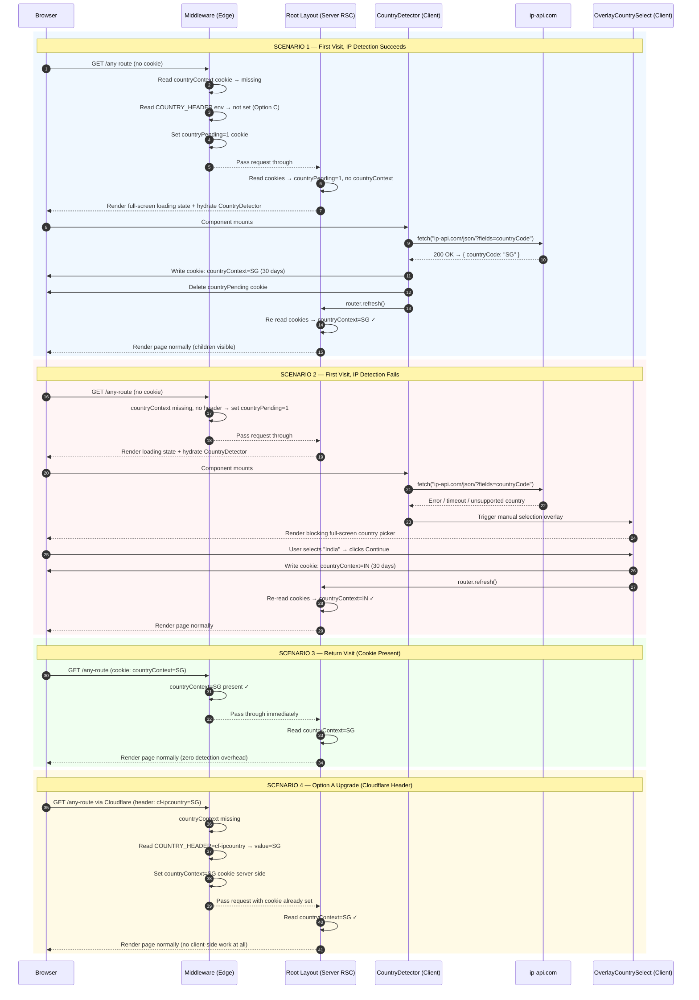

# Country Context POC — Architecture Plan

## Goal
Detect the user's country on every visit and store it globally as `countryContext`.
Without this value no route should be accessible — a blocking overlay forces explicit
selection when auto-detection fails.

---

## Cookie Strategy
`countryContext` is stored as an **HTTP cookie** (not localStorage).

| Why cookie | Benefit |
|---|---|
| Middleware-readable | Enforced server-side before any page renders |
| Survives refresh | No re-detection on every load |
| Tab-safe | Shared across all tabs in the same session |
| SSR/RSC compatible | Available on first paint — no hydration flicker |

Cookie spec:
```
Name:     countryContext
Value:    ISO 3166-1 alpha-2 code  (e.g. "SG", "IN", "US")
Path:     /
MaxAge:   30 days
SameSite: Lax
HttpOnly: false  (client needs to read + rewrite on manual selection)
```

---

## Route Guard — Middleware
Runs at the edge on every request before any page renders.

```
Incoming request
  │
  ├─ Is path /country-select or /_next/* or /api/* ?
  │     └─ Yes → pass through (never block)
  │
  └─ No → read countryContext cookie
        ├─ Cookie present → proceed normally
        └─ Cookie missing → try to detect from header
              ├─ Header found → set cookie + proceed
              └─ Header missing → redirect to /country-select?from=<original path>
```

`/country-select` is a standalone full-screen page (not an overlay) so it works even
if the layout itself has country-gated content.
After the user selects, cookie is written and they are redirected to `?from` path.

---

## Option A — Cloudflare in Front (Preferred for production)

### How it works
Cloudflare sits in front of the pod container and injects a `cf-ipcountry` header on
every request before it reaches Next.js. Middleware reads it, sets the cookie, done.
No client-side API call ever needed.

### Flow
```
Browser → Cloudflare (free plan)
            injects cf-ipcountry: SG
         → Pod / Node server
            → Next.js Middleware
                reads header → sets cookie → proceeds
```

### What we build
| File | Responsibility |
|---|---|
| `proxy.ts` | Read `cf-ipcountry` (env-configurable header name) → set cookie or redirect |
| `app/country-select/page.tsx` | Full-screen country picker (manual fallback) |
| `lib/country-context.ts` | Helpers: read/write cookie, supported country list |

### Environment variable
```env
COUNTRY_HEADER=cf-ipcountry
```
Middleware reads `process.env.COUNTRY_HEADER` — swap to `x-vercel-ip-country` or any
custom header without touching app code.

### Pros
- Detection fires before any JS runs
- Zero latency (header already present)
- Free Cloudflare plan covers it
- Works in local dev by setting a test header in middleware (env flag)

### Cons
- Requires Cloudflare (or comparable proxy) in the infra pipeline
- Local dev needs a workaround (mock header via `.env.local`)

### Local dev workaround
```env
# .env.local
COUNTRY_HEADER=x-mock-country
MOCK_COUNTRY=SG   # middleware injects this value when running locally
```
Middleware checks `NODE_ENV === "development"` → uses `MOCK_COUNTRY` directly.

---

## Option C — Client-Side IP Fallback (Zero infra dependency)

### How it works
No proxy header available. On first visit middleware can't detect country — it lets the
request through but sets a `countryPending=1` cookie. The root layout detects this flag
and triggers a client-side IP lookup (`ip-api.com`, free, no key). Result is written to
the `countryContext` cookie. On next navigation middleware finds the cookie and all is normal.

### Flow
```
Browser → Pod / Node server
            → Next.js Middleware
                no header → set countryPending=1 cookie → proceed
         → Root Layout (server component)
                reads countryPending cookie → renders <CountryDetector /> client component
         → CountryDetector (client)
                fetch("http://ip-api.com/json/?fields=countryCode")
                ├─ success → write countryContext cookie → remove countryPending → rerender
                └─ failure → show country-select overlay (user picks manually)
```

### What we build
| File | Responsibility |
|---|---|
| `proxy.ts` | No header → set `countryPending=1` → pass through |
| `components/country/CountryDetector.tsx` | Client component — IP lookup, cookie write |
| `components/overlay-country-select/index.tsx` | Blocking overlay shown when detection fails |
| `lib/country-context.ts` | Shared helpers (same as Option A) |
| `app/layout.tsx` | Reads cookies, conditionally renders `CountryDetector` or overlay |

### API used
```
GET http://ip-api.com/json/?fields=countryCode
Response: { "countryCode": "SG" }
Free tier: 45 req/min — plenty for a POC / low-traffic site
```

### Pros
- Zero infra changes — works on any plain Node/Docker deployment
- No DNS/proxy setup required
- Same code works in local dev (your own IP resolves to your country)

### Cons
- First-paint flicker possible (overlay appears briefly while API call is in flight)
- Depends on ip-api.com availability (can swap to ipinfo.io as backup)
- Client-side — slightly slower than edge header detection

### Mitigating the flicker
Show a neutral loading state (spinner or skeleton) behind the overlay while the fetch is
in flight. Only show the manual picker if fetch fails or returns an unsupported country.

---

## Shared Components (both options)

### `lib/country-context.ts`
```ts
// Supported country codes for this app
export const SUPPORTED_COUNTRIES = ["SG", "IN", "US", "GB", "AU", "MY"] as const;
export type SupportedCountry = typeof SUPPORTED_COUNTRIES[number];

export const COUNTRY_COOKIE = "countryContext";
export const COUNTRY_COOKIE_MAX_AGE = 60 * 60 * 24 * 30; // 30 days
```

### Country Select Overlay / Page
- Full-screen, centered card
- Native `<select>` of all world countries (reuse `lib/data/countries.ts` — extend to full list later)
- "Continue" button writes cookie and redirects to `?from` path
- No way to dismiss without selecting — enforces the hard requirement

---

## Decision

| Factor | Option A | Option C |
|---|---|---|
| Detection accuracy | Highest (server-edge) | High (client IP) |
| Infra dependency | Cloudflare/proxy required | None |
| First paint | Zero flicker | Possible brief flicker |
| Local dev | Needs mock env var | Works natively |
| Production cost | Free (Cloudflare free plan) | Free (ip-api.com free tier) |
| Code complexity | Low | Low-medium |

**For this POC:** Build Option C first — works immediately in local dev with no infra setup.
Design the code so swapping to Option A is just adding the middleware header-read path (same
`lib/country-context.ts`, same overlay, same cookie — only middleware logic changes).

---

## Implementation Order
1. `lib/country-context.ts` — constants + helpers
2. `proxy.ts` — route guard + Option A header read path
3. `components/country/CountryDetector.tsx` — Option C client IP fetch
4. `components/overlay-country-select/index.tsx` — manual fallback UI
5. `app/layout.tsx` — wire CountryDetector + overlay into root
6. `app/country-select/page.tsx` — standalone fallback page (for proxy redirect)
7. `app/country-context-poc/page.tsx` — demo page (detected country, reset button)
8. `app/page.tsx` — add POC link to home

---

## Sequence Diagram — All 4 Scenarios



---

## Detailed File Breakdown (Option C build)

### `lib/country-context.ts`
Single source of truth for all country-context infrastructure.
```ts
export const COUNTRY_COOKIE  = "countryContext";
export const PENDING_COOKIE  = "countryPending";
export const COOKIE_MAX_AGE  = 60 * 60 * 24 * 30; // 30 days

export const SUPPORTED_CODES = ["SG","IN","US","GB","AU","MY"] as const;
export type SupportedCountry = typeof SUPPORTED_CODES[number];

export function isSupportedCountry(code: string): code is SupportedCountry {
  return SUPPORTED_CODES.includes(code as SupportedCountry);
}
```
Intentionally separate from `lib/data/countries.ts` (phone/dial data) — different domain.

---

### `proxy.ts` (project root, renamed from `middleware.ts` 2026-07-13)
Runs at the edge before every page render.

Decision tree:
1. Skip `/_next/*`, `/api/*`, `/country-select`, static assets → always pass through
2. `countryContext` cookie present → pass through immediately (Scenario 3)
3. `COUNTRY_HEADER` env set + header present in request → set cookie, pass through (Scenario 4)
4. Neither → set `countryPending=1`, pass through (triggers client detection)

No redirects from middleware — the layout handles the blocking UI.
Keeps middleware fast and stateless.

```ts
export const config = {
  matcher: ["/((?!_next/static|_next/image|favicon.ico).*)"],
};
```

**Option A upgrade point** — add this block before step 4:
```ts
const headerName = process.env.COUNTRY_HEADER;
if (headerName) {
  const code = request.headers.get(headerName)?.toUpperCase();
  if (code && isSupportedCountry(code)) {
    res.cookies.set(COUNTRY_COOKIE, code, { maxAge: COOKIE_MAX_AGE, path: "/" });
    return res;
  }
}
```

---

### `components/country/CountryDetector.tsx`
Client component. Mounts only when `countryPending` cookie is present.

Behaviour:
- On mount: `fetch("https://ip-api.com/json/?fields=countryCode,status")` with 5s timeout
- Success + supported country → write `countryContext` cookie, remove `countryPending`, call `router.refresh()`
- Failure OR unsupported country → `setShowPicker(true)` → renders `<OverlayCountrySelect>`
- While fetching → renders full-screen neutral loading state (globe icon + spinner)

---

### `components/overlay-country-select/index.tsx`
Blocking full-screen overlay. Cannot be dismissed without selecting.

UI spec:
- `fixed inset-0 z-50` with backdrop blur
- Centered card — globe icon, headline "Where are you visiting from?", short subtext
- Native `<select>` populated from `COUNTRIES` (extendable to full world list)
- "Continue" button — disabled until a country is chosen
- On confirm → write `countryContext` cookie, delete `countryPending`, `router.refresh()`

Design: shadcn CSS vars, same visual language as rest of app.

---

### `app/layout.tsx` (updated)
```
Server RSC reads cookies():
  country = cookies().get("countryContext")?.value
  pending  = cookies().get("countryPending")?.value

  if (country) → wrap children in <CountryProvider value={country}>, render normally
  if (pending || !country) → render <CountryDetector /> only (full viewport, no children)
```
Children are **never rendered** until `countryContext` is resolved.
`CountryProvider` is a thin React context so any client component can call `useCountry()`.

---

### `app/country-select/page.tsx`
Standalone full-page picker — deep-link safe.
Used when middleware could redirect here (Option A flow or extreme edge cases).
Renders `OverlayCountrySelect` in inline (non-fixed) mode.
On confirm → reads `?from` query param → redirects back.

---

### `app/country-context-poc/page.tsx`
Demo page proving the guard works. Shows:
- Detected country flag + name + code
- Detection method: "Auto-detected" vs "Manually selected"
- "Change country" button → clears cookie → `router.refresh()` → triggers re-detection
- "Reset (clear cookie)" button → for testing Scenario 1 and 2 again

---

## Data Flow Summary

```
Cookie present? ──Yes──▶ Layout renders page ──▶ useCountry() available everywhere
     │
     No
     │
     ▼
Middleware sets countryPending=1
     │
     ▼
Layout renders <CountryDetector> (full screen)
     │
     ├── IP fetch succeeds ──▶ cookie set ──▶ router.refresh() ──▶ page renders
     │
     └── IP fetch fails ──▶ <OverlayCountrySelect> ──▶ user picks ──▶ router.refresh()
```

---

## What We Are NOT Building (scope boundary)
- No server-side API route wrapper — direct client fetch to ip-api.com is fine for POC
- No i18n / locale routing — separate concern
- No cookie encryption — country code is not sensitive data
- No analytics on detection method — can be added later

---

## Status
- [x] Architecture decided
- [x] Sequence diagram documented
- [x] File breakdown written
- [ ] Implementation — ready to build
7. Home page links + POC route updated
