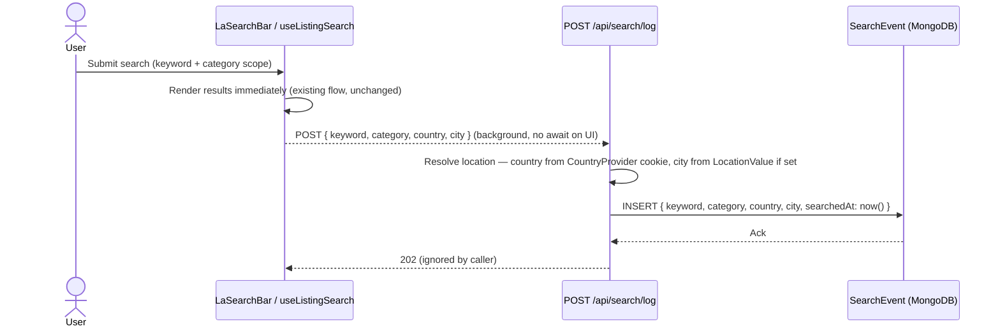
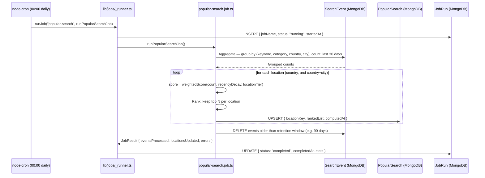
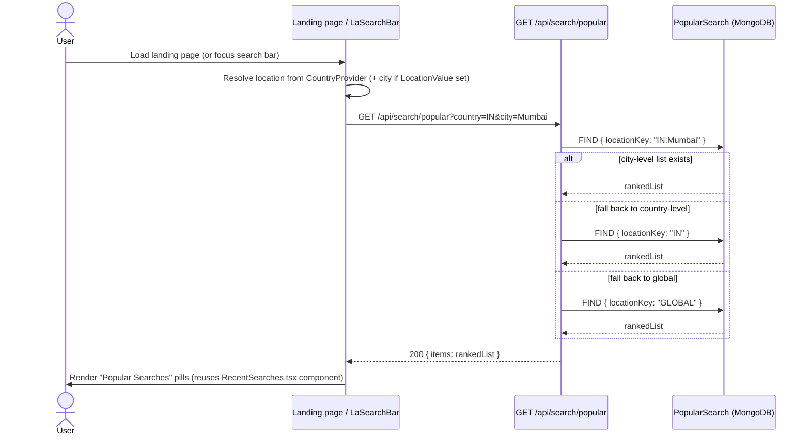

# Popular Searches — Feature Documentation

> **Status:** Proposed / not yet implemented. This is a design doc to plan the feature before any code
> is written — follows the pattern of `md/feature-spec-doc/batch-run.md` (the existing nightly job engine
> this feature extends) and the lighter `md/features/*.md` docs for everything else.

---

## 0. What This Adds vs. What Already Exists

| Capability | Status | Where |
|---|---|---|
| Per-user saved recent searches (signed-in, DB) | ✅ Exists | `models/user.ts` (`recentSearches`), `app/actions/profile/{save,remove,clear}Search.ts` |
| Per-guest recent searches (localStorage) | ✅ Exists | `lib/stores/recentSearchesStore.ts`, `lib/hooks/use-recent-searches.ts` |
| Location-tagged search event log (for aggregation) | ❌ New | `models/SearchEvent.ts` |
| "Popular searches" ranked list, per location | ❌ New | `models/PopularSearch.ts` |
| Nightly batch job to compute popularity | ❌ New | `lib/jobs/popular-search.job.ts` |
| Read API for the popular-searches UI | ❌ New | `app/api/search/popular/route.ts` |

**Key distinction:** the existing `recentSearches` on `User` is a personal convenience list (search
history follows *you*). It deliberately never stores location (`searchUtils.ts` — `mapRecentSearch`
always sets `location: null`). Popularity aggregation is a different concern — it needs to know *where*
every search happened, across *all* users (signed-in or not), which the personal list was never
designed to hold. So this feature adds a **separate, append-only event log**, not a change to `User`.

---

## 1. Use Cases

| # | Use Case | Trigger | Who Sees It |
|---|---|---|---|
| UC1 | **User saved searches** — a signed-in user's own search history, cross-device | Existing — user submits a search | That user only (already built) |
| UC2 | **Location-wise recent search** — every search submission is tagged with the searcher's resolved location (country + city) and logged, independent of the personal recents list | Every search submit (guest or signed-in) | System (feeds UC3); not directly user-facing |
| UC3 | **Popular searches, weighted by location** — a ranked "Popular near you" list shown on the landing page / search bar, favoring searches from the visitor's own city, then country, then global | Page load / search bar focus | All visitors, scoped to their resolved location |
| UC4 | **Nightly batch aggregation** — a nightly job (00:00 local server time) recomputes the ranked popular-searches list per location from the raw event log, so UC3 is a cheap read, never a live aggregation | Cron, `0 0 * * *` | System |

### What This Is NOT (out of scope)

- Real-time/trending-within-the-hour popularity (Twitter-style) — nightly batch only, per the ask.
- Personalized recommendations based on a user's own history — that's `recentSearches` (UC1), unrelated.
- Admin UI to curate/pin popular searches — deferred; DB is the only interface for v1.
- Search event log used for anything beyond popularity ranking (no analytics dashboard in v1).

---

## 2. Sequence Diagrams

### 2.1 — Search event capture (every search, UC2)

Fire-and-forget: never blocks the search results from rendering, and a failure here must never
surface to the user (same pattern already used for `saveSearch` in `use-recent-searches.ts`).



### 2.2 — Nightly batch aggregation (UC4)

Reuses the existing job-runner infrastructure (`lib/jobs/_runner.ts`, `models/JobRun.ts`) that already
powers `alert-match` / `alert-digest` — same wrapper, same health-log pattern, new job function and new
cron entry.



### 2.3 — Read path (landing page / search bar, UC3)

Pure read against the pre-computed table — no aggregation ever runs on the request path.



Called from two places (Section 4.6, Q4): the landing page's new "Popular Searches" section
(`app/page.tsx`, next to the existing "Recent Searches" section), and `LaSearchBar`'s dropdown — but
only there as a fallback, when the visitor has zero `recents` of their own.

---

## 3. Architecture

### 3.1 New Data Models

**`models/SearchEvent.ts`** — append-only log, one document per search submission. Deliberately thin;
it exists only to feed the nightly aggregation, not for user-facing display.

```ts
interface ISearchEvent {
  _id: ObjectId;
  keyword: string;
  category?: string;       // matches Listing category slug, if the search was scoped
  country: string;          // ISO country code — "IN" | "GB" | "SG"
  city?: string;            // from LocationValue, if the searcher had a location set
  searchedAt: Date;
}
```

- Indexed on `{ country: 1, city: 1, searchedAt: -1 }` for the nightly aggregation query.
- TTL or job-driven pruning (Section 2.2) keeps this collection bounded — raw events are not kept
  forever, only the last 30–90 days needed for weighting.

**`models/PopularSearch.ts`** — the materialized, ranked output the UI actually reads.

```ts
interface IPopularSearchItem {
  keyword: string;
  category?: string;
  score: number;
  count: number;            // raw occurrences in the window, for debugging/tuning
}

interface IPopularSearch {
  _id: ObjectId;
  locationKey: string;      // "IN" | "IN:Mumbai" | "GB" | "GB:London" | "GLOBAL"
  items: IPopularSearchItem[];   // pre-sorted, top N (e.g. 20)
  computedAt: Date;
}
```

- One document per `locationKey` (country-level and city-level, plus one `GLOBAL` fallback for
  brand-new locations with no data yet). Upserted nightly — always exactly one doc per key, never
  appended to.

### 3.2 Weighting Algorithm

```
score = count(keyword, category, location) × recencyDecay(daysAgo) × locationTier

recencyDecay(daysAgo) = exp(-daysAgo / HALF_LIFE_DAYS)   // HALF_LIFE_DAYS = 7 — a search from
                                                          // today counts ~2x one from a week ago
locationTier:
  city-level bucket    → weight 1.0  (exact city match)
  country-level bucket → weight 0.6  (country only, no city on the search)
```

**Finalized v1 constants** (Section 4.6, Q1):

| Constant | Value | Meaning |
|---|---|---|
| `HALF_LIFE_DAYS` | `7` | A search from today scores ~2x one from 7 days ago |
| `AGGREGATION_WINDOW_DAYS` | `30` | Only events from the last 30 days feed into scoring |
| `TOP_N` | `20` | Ranked items kept per `locationKey` (UI shows fewer via `maxVisible`) |
| `RETENTION_DAYS` | `90` | Raw `SearchEvent` docs older than this are pruned nightly |

These are launch defaults, not tuned against real traffic — revisit once there's enough search
volume to see if 7-day decay feels too fast/slow in practice.

City-level `PopularSearch` docs are built only from events that had a `city`; country-level docs
aggregate *all* events in that country (city-tagged or not) so a country list is never empty just
because most searches lack a city. This is why UC3's read path (2.3) falls back city → country →
global — a new/low-traffic city naturally inherits its country's ranking until it has enough of its
own data.

### 3.3 Cron Schedule

Extends the existing table in `lib/jobs/index.ts` (currently 4 alert jobs):

| Job | Schedule | Function |
|---|---|---|
| Popular search aggregation | `0 0 * * *` (00:00 daily) | `runPopularSearchJob()` |

`JobName` (in `models/JobRun.ts`) gains `"popular-search"` alongside the existing 4 alert job names —
same enum, same `JobRun` health-log collection, no new infrastructure.

### 3.4 Integration Points

| Direction | From | To | How |
|---|---|---|---|
| Write (per search) | `LaSearchBar` / `useListingSearch` | `POST /api/search/log` | fire-and-forget fetch, mirrors `saveSearch`'s best-effort pattern |
| Abuse guard | `POST /api/search/log` | `lib/rate-limit.ts` | `checkRateLimit(getClientIp(req), ...)` — existing POC-scoped in-memory limiter, same one already guarding autocomplete/handle-check routes |
| Schedule | `lib/jobs/index.ts` (node-cron) | `lib/jobs/popular-search.job.ts` | direct call via `runJob()`, same as alert jobs |
| Aggregate | `popular-search.job.ts` | `models/SearchEvent.ts` | Mongoose aggregation pipeline |
| Materialize | `popular-search.job.ts` | `models/PopularSearch.ts` | upsert per `locationKey` |
| Read | Landing page / search bar | `GET /api/search/popular` | scoped by `CountryProvider` + `LocationValue`, if set |
| Health log | `_runner.ts` (shared, unchanged) | `models/JobRun.ts` | same wrapper already used by alert jobs |

### 3.5 Why Not Compute Live

An on-request aggregation (`SearchEvent.aggregate(...)` on every landing-page load) would scale with
traffic × event volume and hit the DB on the hottest page in the app. Precomputing nightly makes the
read path a single indexed `findOne({ locationKey })` — the same trade-off already made for
`alert-match` (batch, not live-triggered per listing).

---

## 4. Functional Implementation

### 4.1 File Map

```
models/
  SearchEvent.ts                 ← new — append-only search log
  PopularSearch.ts                ← new — materialized ranked list per location
  JobRun.ts                       ← modified — JobName union gains "popular-search"

lib/jobs/
  popular-search.job.ts           ← new — runPopularSearchJob(): aggregate → weight → upsert → prune
  index.ts                        ← modified — register 00:00 daily cron entry
  _types.ts                       ← modified — JobResult extended with eventsProcessed/locationsUpdated, or a job-specific result type

app/api/search/
  log/route.ts                    ← new — POST, writes one SearchEvent, always 202 (never blocks caller)
  popular/route.ts                ← new — GET ?country=&city=, reads PopularSearch with fallback chain

app/api/jobs/trigger/route.ts     ← modified — JOB_MAP gains "popular-search" for manual/dev trigger

components/la-blocks/RecentSearches.tsx   ← reused as-is for rendering (already the exact "dismissible
                                             pill" component recent-searches uses; popular searches
                                             need the same shape: id/label/href/icon)

app/page.tsx                      ← modified — new <RecentSearches title="Popular Searches" .../>
                                     section, placed directly after the existing "Recent Searches"
                                     section (line ~190) that already renders on the landing page

components/la-search-bar/LaSearchBar.tsx  ← modified — dropdown falls back to popular searches when
                                             the visitor has no recents (see Section 4.6, Q4)
```

### 4.2 Write Path — `POST /api/search/log`

Called from wherever a search is actually submitted (`useListingSearch`, `LaSearchBar` submit
handler) — not from `saveSearch` itself, since popularity must include guest searches and `saveSearch`
only runs for signed-in users. Best-effort: caller does not `await` it before showing results, and a
failure is swallowed (identical pattern to `use-recent-searches.ts`'s `.catch(() => {})`).

```ts
// app/api/search/log/route.ts (shape, not final code)
POST body: { keyword: string; category?: string }
  → checkRateLimit(getClientIp(req), 20, 60_000) — 20 req/min per IP; over limit → 429 via rateLimitResponse()
    (reuses lib/rate-limit.ts as-is; generous enough for real typing/search behavior, blunts scripted abuse
    per Section 4.6 Q2 — same POC caveat as the rest of the app: in-memory, per-instance, not distributed)
  → resolve country from request (cf-ipcountry / cookie, same source proxy.ts already uses)
  → resolve city from LocationValue if the client sent one
  → SearchEvent.create({ keyword, category, country, city, searchedAt: new Date() })
  → 202, body ignored by caller
```

### 4.3 Batch Job — `lib/jobs/popular-search.job.ts`

```ts
export async function runPopularSearchJob(): Promise<JobResult> {
  await dbConnect();

  const since = daysAgo(30);
  const grouped = await SearchEvent.aggregate([
    { $match: { searchedAt: { $gte: since } } },
    { $group: {
        _id: { keyword: "$keyword", category: "$category", country: "$country", city: "$city" },
        count: { $sum: 1 },
        lastSeen: { $max: "$searchedAt" },
    }},
  ]);

  const byLocation = bucketByLocationKey(grouped); // "IN", "IN:Mumbai", "GB", ... + city rolls up into its country bucket too

  for (const [locationKey, items] of byLocation) {
    const ranked = items
      .map((i) => ({ ...i, score: weightedScore(i) }))
      .sort((a, b) => b.score - a.score)
      .slice(0, TOP_N);

    await PopularSearch.findOneAndUpdate(
      { locationKey },
      { $set: { items: ranked, computedAt: new Date() } },
      { upsert: true }
    );
  }

  await SearchEvent.deleteMany({ searchedAt: { $lt: daysAgo(RETENTION_DAYS) } });

  return { eventsProcessed: grouped.length, locationsUpdated: byLocation.size, errors: 0 };
}
```

### 4.4 Read Path — `GET /api/search/popular`

```ts
// app/api/search/popular/route.ts (shape, not final code)
GET ?country=IN&city=Mumbai
  → try PopularSearch.findOne({ locationKey: `${country}:${city}` })
  → fall back PopularSearch.findOne({ locationKey: country })
  → fall back PopularSearch.findOne({ locationKey: "GLOBAL" })
  → map items → RecentSearchItem[] shape (id/label/href/icon) → feed into <RecentSearches title="Popular Searches" items={...} />
```

### 4.5 Cold-Start Behavior

Before the first nightly run (or for a brand-new deployment with an empty `SearchEvent` collection),
`GET /api/search/popular` finds nothing at any tier and returns an empty list. The UI should treat an
empty popular-searches response the same way `RecentSearches` already treats an empty `items` array —
render nothing (`RecentSearches.tsx` already no-ops when `items` is empty), not an error state.

### 4.6 Decisions

All four questions resolved 2026-08-13 — recorded here rather than deleted, per the append-only
decisions-log convention used in `md/feature-spec-doc/*.md`.

| # | Question | Decision | Rationale |
|---|---|---|---|
| 1 | `HALF_LIFE_DAYS`, `TOP_N`, `RETENTION_DAYS` — final tuning values? | `HALF_LIFE_DAYS=7`, `AGGREGATION_WINDOW_DAYS=30`, `TOP_N=20`, `RETENTION_DAYS=90` (Section 3.2) | Launch defaults — no real traffic yet to tune against. 90-day raw retention gives room to re-derive with a different window later without losing history; 30-day scoring window keeps rankings responsive to what's trending now, not stale. |
| 2 | Should `POST /api/search/log` be rate-limited / bot-filtered? | Yes — reuse `lib/rate-limit.ts` (`checkRateLimit` + `getClientIp`, already guarding autocomplete/handle-check routes) at 20 req/min per IP | It's an existing, already-adopted pattern in this codebase — no new dependency. Same documented POC caveat as its other callers: in-memory, per-instance, not distributed; fine for now, `TODO [INTEGRATION — BEFORE PRODUCTION]` already flagged in that file for a real limiter later. |
| 3 | Does city-level need its own retention/index strategy, or is one `SearchEvent` collection enough at current traffic? | One collection is enough for v1 | Matches the rest of the app at this stage — `app/page.tsx` already notes real listing volume is "currently tiny." The `{ country: 1, city: 1, searchedAt: -1 }` index (Section 3.1) covers both tiers without a split collection. Add the same `TODO [scalability]` cursor-streaming note `alert-digest.job.ts` already carries, for when volume grows. |
| 4 | Where exactly does "Popular Searches" render? | Both: a new landing-page section (`app/page.tsx`, next to the existing "Recent Searches" block) **and** inside `LaSearchBar`'s dropdown — but in the dropdown only as a fallback when `recents.length === 0` | A brand-new visitor's dropdown is currently blank until they search once (`showRecents` requires `recents.length > 0`). Falling back to popular searches gives new users something useful immediately, without changing behavior for anyone who already has recents. |
