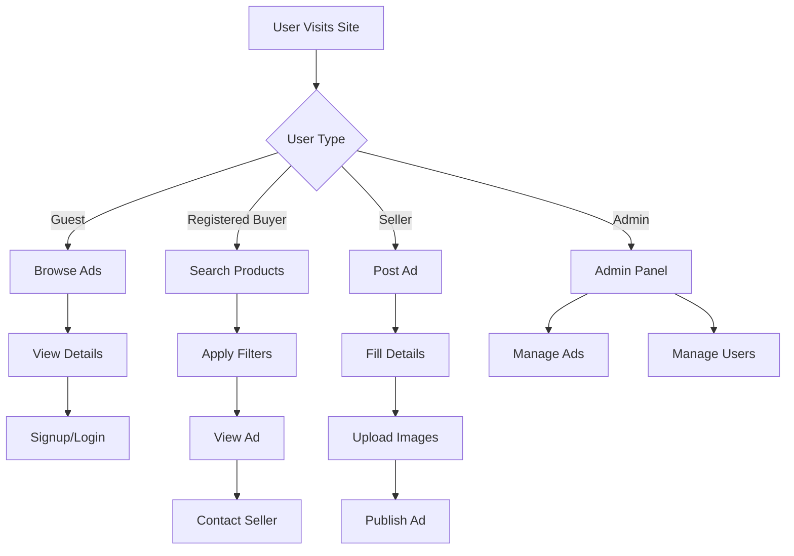

# 👤 User Flow – LokalAds

## 📌 Overview

This document explains how different users interact with the LokalAds platform.

---

## 🧍 Guest User Flow

1. User visits homepage
2. Browses categories or featured ads
3. Uses search and filters
4. Views product details
5. Option to:

   * Contact seller (limited)
   * Sign up for full access

---

## 🛍️ Buyer Flow (Registered User)

1. User signs up / logs in
2. Searches for products
3. Applies filters:

   * Category
   * Price
   * Location
4. Views product details
5. Contacts seller via:

   * Chat
   * Phone number
6. Finalizes deal offline

---

## 🧾 Seller Flow

1. User logs in
2. Clicks **Post Ad**
3. Fills ad details:

   * Title
   * Description
   * Price
   * Category
   * Location
4. Uploads images
5. Submits ad
6. Ad gets:

   * Published (or)
   * Sent for admin approval
7. Receives buyer inquiries
8. Edits or deletes ad if needed

---

## 🛠️ Admin Flow

1. Admin logs into dashboard
2. Reviews:

   * New ads
   * Reported ads
3. Actions:

   * Approve / Reject ads
   * Delete spam
4. Manages users:

   * Block / Unblock
5. Monitors platform activity

---

## 🔁 Combined Flow Diagram

---
